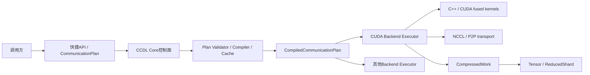
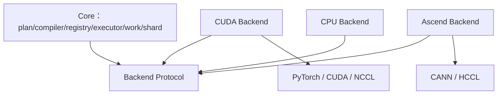
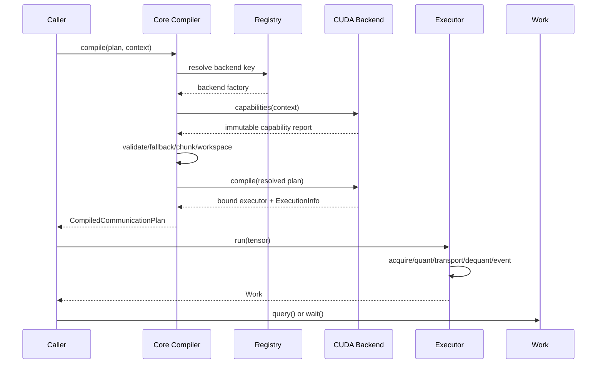

# CCDL GPU优先架构实施基线

## 1. 文档状态

- 版本：1
- 日期：2026-07-31
- 状态：GPU首期实施基线
- 适用范围：`ccdl-core`协议边界、`ccdl-cuda`生产路径及现有`ccdl_comm`迁移
- 首要平台：NVIDIA GPU、CUDA 12.1、NCCL、PyTorch 2.4
- 首要验证环境：2/4卡NVIDIA RTX A6000

本文件冻结后续代码开发使用的架构契约。《软件需求规格说明书》定义“必须具备什么”，《软件设计说明书》描述完整目标设计，本文件进一步固定首期实现中的模块依赖、公共类型、compile/run边界、对象所有权和迁移顺序。

机器可读契约位于`docs/architecture/architecture_contract.json`。文档与JSON冲突时必须停止实现、修正文档并重新审查，不能由代码自行选择一种解释。

## 2. 架构目标

CCDL是独立的低比特高性能通信库，不承担模型切分、优化器、数据加载、checkpoint或训练任务调度。

首期架构目标是：

1. GPU/CUDA/NCCL优先。
2. 通信性能优先。
3. 计划编译一次，稳态直接执行。
4. 策略由调用方显式声明，`auto`必须显式启用。
5. 显式策略默认严格失败，fallback必须显式声明。
6. Core和backend单向依赖。
7. 异步Work、CUDA event和workspace生命周期严格有序。
8. 同仓库维护公共协议和backend源码，通过独立包与构建产物隔离。

## 3. 系统上下文



调用方可以使用快捷API完成一次性通信，也可以显式创建并复用Compiled Plan。训练热路径、高频bucket和重复P2P必须复用Compiled Plan。

## 4. 控制面与数据面

### 4.1 控制面

控制面只在首次初始化、显式重新编译或compile cache miss时运行，负责：

- 验证`CommunicationPlan`；
- 查找Backend Registry；
- 获取backend capability；
- 解析显式fallback或`auto`策略；
- 验证rank、world size、process group和拓扑；
- 验证shape、dtype、layout、bit和group size；
- 生成chunk plan；
- 规划workspace容量和key；
- 绑定CUDA stream、transport和kernel入口；
- 创建不可变`ExecutionInfo`；
- 生成`CompiledCommunicationPlan`。

控制面允许Python对象、字符串和诊断信息，但不得在每个训练step重复执行。

### 4.2 数据面

数据面由已绑定Executor执行，固定顺序为：

```text
tensor
  -> executor.run()
  -> acquire WorkspaceLease
  -> fused quant-pack
  -> bound NCCL/P2P transport
  -> fused dequant-reduce-mean-EF
  -> record CUDA completion event
  -> Work(Tensor | ReducedShard)
```

稳态`run()`禁止：

- 解析策略字符串；
- 查询Registry；
- 探测capability；
- 决定fallback；
- 创建process group；
- 创建CUDA stream；
- 重新计算workspace形状；
- Python逐rank反量化；
- 无条件CPU同步。

## 5. 模块分层与依赖方向



依赖规则：

- Core不得导入Torch、CUDA、CANN或具体backend。
- Backend依赖Core协议，Core不得反向依赖backend。
- CUDA与Ascend不得互相导入源码或构建工具。
- `ccdl_comm.capability`中的现有运行时探测属于迁移适配层，不进入未来`ccdl-core`；纯数据`BackendCapabilities`由Core定义。
- transport只负责执行通信，不负责策略选择。
- kernel只负责数值计算和buffer写入，不负责训练调度。
- 快捷API可以调用Compiler；Compiled Executor不得回到快捷API。

## 6. 首期公共类型

### 6.1 WorkspacePolicy

```python
@dataclass(frozen=True)
class WorkspacePolicy:
    cache: bool = True
    max_cached_bytes: int | None = None
    max_entries: int | None = None
    stream_safe: bool = True
```

### 6.2 CommunicationStage

```python
@dataclass(frozen=True)
class CommunicationStage:
    name: str
    collective: str
    strategy: str
    backend: str = "cuda"
    compression: CompressionConfig | None = None
    process_group: object | None = None
    output_layout: str = "full"
    async_op: bool = True
```

### 6.3 CommunicationPlan

```python
@dataclass(frozen=True)
class CommunicationPlan:
    collective: str
    strategy: str
    backend: str = "cuda"
    compression: CompressionConfig | None = None
    stages: tuple[CommunicationStage, ...] = ()
    fallback: tuple[str, ...] = ()
    output_layout: str = "full"
    async_op: bool = True
    workspace_policy: WorkspacePolicy = WorkspacePolicy()
```

`strategy="hierarchical"`必须提供Stage。显式策略不支持且`fallback`为空时抛`UnsupportedCollective`。

### 6.4 CompileContext

```python
@dataclass(frozen=True)
class CompileContext:
    rank: int
    world_size: int
    device: str
    shape: tuple[int, ...]
    dtype: str
    layout: str = "contiguous"
    local_rank: int | None = None
    local_world_size: int | None = None
    node_id: int | None = None
    node_count: int | None = None
    process_group: object | None = None
    process_groups: Mapping[str, object] = field(default_factory=dict)
    topology_signature: str = "unknown"
    workspace_budget_bytes: int | None = None
    allow_dynamic_shape: bool = False
```

### 6.5 ExecutionInfo

```python
@dataclass(frozen=True)
class ExecutionInfo:
    requested_strategy: str
    executed_strategy: str
    backend: str
    fallback_used: bool
    fallback_reason: str | None
    stage_names: tuple[str, ...]
    original_bytes: int
    compressed_bytes: int
    compression_ratio: float
    workspace_cache_hit: bool
    async_capable: bool
    fast_path: str
```

复杂扩展信息使用不可变mapping。运行阶段只更新预分配整数计数，不重新构建字符串诊断对象。

### 6.6 Backend与Executor

```python
class CommunicationBackend(Protocol):
    name: str
    abi_version: int

    def capabilities(self, context: CompileContext) -> BackendCapabilities:
        ...

    def compile(
        self,
        plan: CommunicationPlan,
        context: CompileContext,
    ) -> CompiledExecutor:
        ...


class CompiledExecutor(Protocol):
    execution_info: ExecutionInfo

    def run(self, tensor: object) -> CollectiveWork[object]:
        ...
```

Registry键固定为：

```text
collective + strategy + backend + output_layout
```

### 6.7 CompiledCommunicationPlan

```python
@dataclass(frozen=True)
class CompiledCommunicationPlan:
    executor: CompiledExecutor
    execution_info: ExecutionInfo
    cache_key: CompileCacheKey

    def run(self, tensor: object) -> CollectiveWork[object]:
        return self.executor.run(tensor)
```

### 6.8 CollectiveWork

```python
class CollectiveWork(Protocol[T]):
    @property
    def execution_info(self) -> ExecutionInfo:
        ...

    def wait(self) -> T:
        ...

    def query(self) -> bool:
        ...

    def get_future(self) -> object | None:
        ...
```

`query()`只能观察状态，不能执行延迟callback或触发同步。

### 6.9 ReducedShard

`ReducedShard`包含shard tensor、索引、逻辑长度、原始shape/numel、padding、world size、reduce语义、dtype、layout、transport和扩展metadata。它不绑定任何训练框架。

## 7. 编译与执行时序



## 8. 对象状态与所有权

| 对象 | 创建者 | 持有资源 | 释放条件 |
|---|---|---|---|
| `CommunicationPlan` | 调用方 | 不持有in-flight资源 | 调用方释放 |
| `CompiledCommunicationPlan` | Compiler/cache | Executor和静态元数据 | cache淘汰且无引用 |
| `CompiledExecutor` | Backend Compiler | stream、transport、workspace plan | Compiled Plan释放 |
| `WorkspaceLease` | Executor | send/recv/reduced/metadata buffer | completion event ready |
| `CompressedWork` | Executor | transport work、event、lease、payload | 完成且无引用 |
| `ReducedShard` | Work完成链 | 本rank结果tensor和元数据 | 调用方释放 |

Work的状态机固定为：

```text
CREATED -> TRANSPORT_IN_FLIGHT -> CUDA_POSTPROCESS_IN_FLIGHT -> READY
   |                 |                       |
   +-----------------+-----------------------+-> FAILED
```

重复`wait()`返回同一逻辑结果，异常只传播不重复执行callback。

## 9. CUDA数据面

生产INT8路径目标：

```text
fused quant-pack（一次主kernel）
compressed transport
fused dequant-reduce-mean-EF（一次主kernel）
completion event
```

Workspace由bucket shape class、dtype、world size、bit、group size、chunk plan和kind组成key。相同稳态bucket第2次开始不得显式分配。

4卡以上优先使用compressed reduce-scatter或ReducedShard输出。all-gather-reduce保留为小world size、兼容和安全路径，不能作为所有拓扑的唯一实现。

## 10. 构建与发布边界

实施初期维持单wheel，内部先形成以下边界：

```text
ccdl_comm/core protocol
ccdl_comm/cuda backend
ccdl_comm/ascend backend
```

Core ABI稳定后拆为：

```text
ccdl-core
ccdl-cuda
ccdl-ascend
ccdl-cpu（可选）
```

Core不得硬依赖Torch；CUDA包不得包含CANN源码；Ascend包不得包含CUDA源码。

## 11. 迁移顺序

1. 冻结本架构和机器契约。
2. 冻结正确性及A6000性能基线。
3. 提取Core不可变类型、Work和ReducedShard。
4. 引入Backend Protocol、Registry、严格Compiler和Compile Cache。
5. 用CUDA Executor适配现有实现，不立即重写transport。
6. 统一ExecutionInfo、workspace和native Work生命周期。
7. 接入融合quant/dequant kernel并消除生产中间分配。
8. 实现真正compressed reduce-scatter和流水化拓扑。
9. 完成分层通信、P2P、动态shape和collective conformance。
10. 稳定ABI后拆分多wheel。
11. 通过真实训练与发布门禁。

## 12. 被拒绝方案

### 12.1 长期backend分支

拒绝。分支会让公共协议、修复和测试矩阵长期漂移。采用同仓库独立源码和wheel。

### 12.2 每step运行策略管理器

拒绝。字符串解析、capability探测和fallback会进入热路径。采用compile once和直接Executor。

### 12.3 立即重写全部CUDA与transport

拒绝。现有codec、CUDA kernel、P2P、topology和workspace已有验证资产。先适配，再由benchmark决定替换。

### 12.4 所有world size统一all-gather完整恢复

拒绝。接收显存和通信量随world size增长，4卡以上优先compressed shard或分层路径。

### 12.5 显式策略静默fallback

拒绝。它使性能和语义不可解释。显式策略默认抛错，只有声明fallback或`auto`才允许切换。

## 13. 架构变更规则

以下变化必须先修改本文件和JSON契约并单独提交：

- Core公共类型字段或语义；
- Backend Protocol或ABI；
- control/data plane边界；
- Work或workspace释放条件；
- Registry键；
- 显式策略和fallback语义；
- backend依赖方向；
- 默认热路径允许的同步行为。

普通kernel调优、阈值更新或新增显式strategy在不改变上述契约时，不需要提升架构版本。
