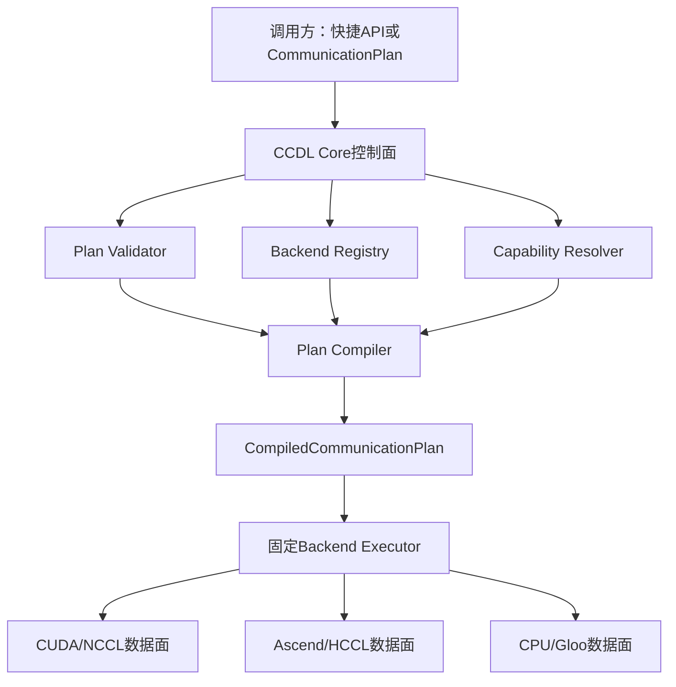
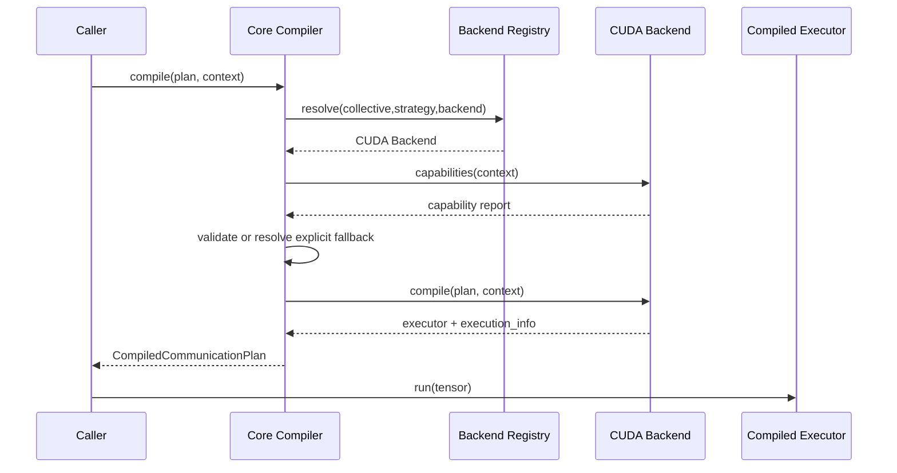

# CCDL 低比特高性能通信库软件设计说明书

## 1. 文档信息

- 文档状态：目标架构设计基线
- 版本：1.0
- 日期：2026-07-30
- 设计重点：GPU优先、性能第一
- 首要后端：CUDA/NCCL
- 首要验证平台：2/4卡NVIDIA RTX A6000

## 2. 设计目标

本设计将CCDL构建为“计划编译一次、后端直接执行”的独立低比特通信库。

管理层只存在于初始化和cache miss路径。训练稳态热路径不得动态解释策略，而应直接进入已绑定的C++/CUDA Executor。

CUDA、Ascend和CPU源码可共处单一仓库，但通过Backend Protocol、独立目录和独立构建产物隔离，不使用长期Git分支维护后端版本。

## 3. 总体架构



控制面负责：

- 解析；
- 验证；
- 注册查找；
- fallback；
- 拓扑；
- process group；
- workspace规划；
- executor构建。

数据面负责：

- quant-pack；
- collective或P2P；
- dequant-reduce；
- mean；
- Error Feedback；
- completion event；
- 返回结果。

## 4. 目标仓库结构

```text
lowbit_comm/
├── packages/
│   ├── ccdl-core/
│   │   └── ccdl_core/
│   │       ├── plan.py
│   │       ├── stage.py
│   │       ├── backend.py
│   │       ├── registry.py
│   │       ├── compiler.py
│   │       ├── executor.py
│   │       ├── work.py
│   │       ├── capability.py
│   │       ├── execution_info.py
│   │       ├── shard.py
│   │       └── exceptions.py
│   │
│   ├── ccdl-cuda/
│   │   └── ccdl_cuda/
│   │       ├── backend.py
│   │       ├── compiler.py
│   │       ├── executors/
│   │       ├── transports/
│   │       ├── workspace.py
│   │       ├── cpp/
│   │       └── kernels/
│   │
│   ├── ccdl-ascend/
│   │   └── ccdl_ascend/
│   │       ├── backend.py
│   │       ├── executors/
│   │       ├── transports/
│   │       ├── cpp/
│   │       └── cann/
│   │
│   └── ccdl-cpu/
│
├── tests/
│   ├── core/
│   ├── conformance/
│   ├── cuda/
│   ├── ascend/
│   └── distributed/
│
└── benchmarks/
```

迁移阶段可以继续使用`ccdl_comm`顶层包，但内部必须先形成相同边界。多wheel发布在Core ABI稳定后实施。

## 5. Core数据模型

### 5.1 CommunicationStage

```python
@dataclass(frozen=True)
class CommunicationStage:
    name: str
    collective: str
    strategy: str
    backend: str
    compression: CompressionConfig | None
    process_group: object | None = None
    output_layout: str = "full"
    async_op: bool = True
```

Stage描述一个不可分割的通信阶段，不包含训练框架逻辑。

### 5.2 CommunicationPlan

```python
@dataclass(frozen=True)
class CommunicationPlan:
    collective: str
    strategy: str
    backend: str = "cuda"
    compression: CompressionConfig | None = None
    stages: tuple[CommunicationStage, ...] = ()
    fallback: tuple[str, ...] = ()
    output_layout: str = "full"
    async_op: bool = True
```

简单策略可以没有Stage。hierarchical策略必须展开为Stage序列。

### 5.3 CompileContext

CompileContext包含：

- rank和world size；
- local rank和local world size；
- node count和node id；
- process groups；
- device；
- tensor shape、dtype和layout；
- GPU拓扑；
- backend capability；
- workspace预算；
- 是否允许动态shape。

### 5.4 ExecutionInfo

```python
@dataclass(frozen=True)
class ExecutionInfo:
    requested_strategy: str
    executed_strategy: str
    backend: str
    fallback_used: bool
    fallback_reason: str | None
    stage_names: tuple[str, ...]
    original_bytes: int
    compressed_bytes: int
    fast_path: str
```

ExecutionInfo由编译阶段生成，运行阶段只更新必要计数，不构建复杂Python对象。

## 6. Backend Protocol

```python
class CommunicationBackend(Protocol):
    name: str
    abi_version: int

    def capabilities(self, context: CompileContext) -> BackendCapabilities:
        ...

    def compile(
        self,
        plan: CommunicationPlan,
        context: CompileContext,
    ) -> CompiledExecutor:
        ...
```

Backend不得在每次`run()`时重新选择strategy。

### 6.1 注册键

```text
collective + strategy + backend + output_layout
```

例如：

```text
all_reduce + ring + cuda + full
reduce_scatter + compressed + cuda + shard
all_reduce + hierarchical + cuda + full
```

### 6.2 注册时机

- backend包导入时注册；
- 或由应用显式调用`register_backend()`；
- 注册只影响控制面；
- Executor不在热路径查询Registry。

## 7. Plan Compiler

### 7.1 编译流程



### 7.2 严格策略

```python
if requested_supported:
    compile_requested()
elif plan.fallback:
    compile_first_supported_fallback()
else:
    raise UnsupportedCollective(...)
```

`auto`实现为一个显式的控制面Planner，不参与Executor热路径。

### 7.3 编译缓存

缓存键至少包含：

```text
backend
collective
strategy
shape class
dtype
layout
world size
process group identity
bit
group size
topology signature
workspace policy
```

动态shape使用shape class或容量上界，不为每个细微长度重新创建Executor。

## 8. Compiled Executor

```python
class CompiledExecutor(Protocol):
    execution_info: ExecutionInfo

    def run(self, tensor: object) -> Work:
        ...
```

生产GPU Executor应由C++对象承载。Python Executor只用于：

- CPU参考实现；
- fake transport；
- 测试；
- unsupported fast-path fallback。

### 8.1 热路径约束

`run()`不得执行：

- 字符串策略匹配；
- Registry查找；
- capability探测；
- process group创建；
- stream创建；
- workspace尺寸规划；
- fallback决策；
- Python逐rank循环反量化。

## 9. CUDA Backend设计

### 9.1 CUDA Backend职责

- 解析NCCL process group；
- 选择已注册的CUDA Executor；
- 创建或复用communication stream；
- 创建workspace pool；
- 编译kernel配置；
- 构建C++ CompressedWork；
- 提供NVTX和执行统计；
- 处理CUDA/NCCL异步错误。

### 9.2 C++ CompressedWork

C++ Work持有：

- ProcessGroup Work；
- CUDA stream；
- producer event；
- completion event；
- input/output Tensor；
- send/recv/reduced workspace；
- metadata workspace；
- error feedback状态；
- Executor生命周期引用；
- 异常状态。

接口：

```text
wait
query
getFuture
result
executionInfo
```

### 9.3 CUDA热路径


Python只启动一次Executor。

### 9.4 Fused quant-pack

一个主kernel完成：

- group statistics；
- scale；
-量化；
- clamp/round；
- bit pack；
- metadata写入；
- contiguous payload输出。

### 9.5 Fused dequant-reduce

一个主kernel完成：

- 多rank payload读取；
- unpack；
- dequant；
- sum；
- mean；
- Error Feedback residual更新；
- full tensor或ReducedShard写出。

禁止为每rank创建完整restored Tensor。

## 10. GPU策略设计

### 10.1 all-gather-reduce

适用：

- world size较小；
-实现成熟；
-动态shape；
-安全fallback。

限制：

- 每rank接收所有payload；
-通信量和显存随world size增长。

### 10.2 compressed reduce-scatter

流程：

1. tensor按目标rank切分；
2. fused quant-pack；
3. compressed all-to-all或ring交换；
4. 本地fused dequant-reduce；
5. 返回ReducedShard；
6. 只有full consumer显式要求时执行最终all-gather。

### 10.3 pipelined compressed ring

大bucket使用chunk和双缓冲：

```text
chunk N-1：dequant-reduce
chunk N：send/recv
chunk N+1：quant-pack
```

状态机应在C++层运行，不在Python逐轮`wait()`。

### 10.4 tree和p2p

tree用于低rank规模和低延迟路径；p2p用于可控拓扑和分片交换。两者必须由Compiled Executor固定拓扑计划。

### 10.5 策略阈值

阈值在compile阶段确定：

- 小bucket：native或轻量同步路径；
- 中bucket：compressed all-gather；
- 大bucket：compressed reduce-scatter/ring；
- sharded consumer：直接ReducedShard；
- 多机：hierarchical。

只有`auto`计划使用阈值选择。

## 11. 分层通信设计

示例计划：

```python
CommunicationPlan(
    collective="all_reduce",
    strategy="hierarchical",
    stages=(
        CommunicationStage(
            name="intra_node",
            collective="reduce_scatter",
            strategy="compressed",
            backend="cuda",
            compression=int8_config,
            output_layout="shard",
        ),
        CommunicationStage(
            name="inter_node",
            collective="all_reduce",
            strategy="ring",
            backend="cuda",
            compression=int4_config,
            output_layout="shard",
        ),
        CommunicationStage(
            name="restore",
            collective="all_gather",
            strategy="native",
            backend="cuda",
            compression=None,
            output_layout="full",
        ),
    ),
)
```

sharded consumer删除restore Stage。

process group必须在compile阶段创建或由调用方提供，禁止在训练step中创建。

## 12. Workspace设计

### 12.1 类型

- send workspace；
- recv workspace；
- reduced workspace；
- metadata workspace；
- chunk double buffer；
- Error Feedback residual。

### 12.2 生命周期

- Executor持有稳定workspace lease；
- Work持有当前in-flight引用；
- completion event完成前不得复用；
- PyTorch allocator Tensor必须记录使用stream；
- cache按显存预算淘汰；
- 淘汰不得同步整个设备。

### 12.3 所有权

```text
Workspace Pool
    → Executor Lease
        → Work In-flight Reference
            → completion后释放给Pool
```

## 13. 异步完成语义

### 13.1 同步API

同步API调用相同Executor并在返回前等待Work完成。

### 13.2 异步API

异步API立即返回Work。Work只有在以下条件全部满足时完成：

1. backend通信完成；
2. dequant/reduce完成；
3. mean和EF完成；
4. completion event已记录；
5. 输出对消费stream可见。

### 13.3 Query

`query()`只查询backend Work和event状态，不运行callback，不执行CPU同步。

## 14. 错误与Fallback

错误分类：

- InvalidPlan；
- BackendUnavailable；
- UnsupportedCollective；
- UnsupportedQuantization；
- WorkspaceExhausted；
- AsyncCommunicationError；
- KernelLaunchError。

fallback只能在compile阶段发生。执行过程中发生通信或kernel错误时不得静默切换策略并继续训练。

## 15. 多包构建设计

### 15.1 Core

- 纯Python或轻量C++；
- 不硬依赖torch；
- 定义协议、计划、异常和元数据。

### 15.2 CUDA

- 依赖PyTorch CUDA、CUDA Toolkit和NCCL；
- 构建CUDA/C++扩展；
- 只注册CUDA Backend；
- wheel包含对应架构策略或JIT安全构建能力。

### 15.3 Ascend

- 依赖torch_npu、CANN和HCCL；
- 独立构建；
- 不导入CUDA模块；
- 使用相同Core ABI和conformance测试。

### 15.4 版本关系

Backend声明：

```text
core_abi_min
core_abi_max
backend_version
kernel_abi_version
```

## 16. 公共API设计

### 16.1 简单API

```python
work = ccdl.all_reduce(
    tensor,
    strategy="ring",
    backend="cuda",
    compression=CompressionConfig(bit=8),
    async_op=True,
)
```

简单API内部命中Compiled Plan缓存。

### 16.2 显式编译API

```python
executor = ccdl.compile(
    plan,
    context=CompileContext.from_process_group(group, sample_tensor),
)

for bucket in buckets:
    work = executor.run(bucket)
```

性能敏感调用方应优先使用显式编译API。

### 16.3 后端直接API

```python
executor = ccdl_cuda.compile_ring(plan, context)
```

直接API和通用API必须返回同类Executor，并调用同一C++热路径。

## 17. 测试设计

### 17.1 Core测试

- Plan不可变性；
- Registry；
- capability；
-严格fallback；
-缓存键；
- ExecutionInfo；
- Backend ABI。

### 17.2 Backend Conformance

所有Backend实现相同测试契约：

- compile；
- run；
- wait/query；
- dtype；
- shape；
-错误；
-执行信息。

### 17.3 CUDA测试

- quant/dequant；
- fused kernel；
- stream/event顺序；
- workspace复用；
- P2P；
- all-gather；
- reduce-scatter；
- ring/tree；
- hierarchical；
-动态shape。

### 17.4 Benchmark

必须记录：

- 环境和commit；
- GPU拓扑；
- tensor大小；
- dtype/bit/group size；
-原始和压缩字节数；
- quant、communication、dequant耗时；
- launch、wait和overlap耗时；
-吞吐和有效带宽；
-显存；
-误差。

正式比较至少包含：

- PyTorch/NCCL；
- 当前稳定CCDL；
- 新Executor；
- 同步；
- 异步；
- 2卡；
- 4卡。

## 18. 迁移设计

### 阶段一：Core边界

- 新增Plan、Stage、Backend Protocol、Registry和ExecutionInfo。
- 保留现有公共API。
- 不修改CUDA kernel。

### 阶段二：CUDA Executor

- 将现有all-gather、topology和reduce-scatter包装为Compiled Executor。
- 公共API通过缓存调用Executor。
- 验证管理开销低于1%。

### 阶段三：C++ Work

- 将通信完成链下沉C++；
- Python不再处理hot-path callback；
- 降低launch开销。

### 阶段四：融合kernel

- fused quant-pack；
- fused dequant-reduce-mean-EF；
- workspace稳态零分配。

### 阶段五：真正compressed collective

- compressed reduce-scatter；
- pipelined ring；
- sharded consumer。

### 阶段六：分层与多机

- Stage编排；
-节点内/节点间process group；
- 8卡及多机验证。

### 阶段七：多包发布

- 拆分core、cuda、ascend wheel；
- 保持单仓库；
- 建立ABI与conformance CI。

## 19. 主要风险

### 19.1 抽象进入热路径

通过Compiled Executor、缓存和C++对象避免。

### 19.2 后端接口过早固化

先用CUDA实现验证Backend Protocol，再稳定Core ABI。

### 19.3 多包增加构建复杂度

先建立源码边界，后拆wheel，避免同时重构执行和发布系统。

### 19.4 异步buffer被提前复用

使用Work资源持有、event和allocator stream记录。

### 19.5 压缩通信并不更快

设置bucket阈值，以同口径benchmark决定默认策略；显式策略仍按用户请求执行。

### 19.6 INT4精度风险

INT8先成为稳定生产路径；INT4必须通过真实训练和Error Feedback验证。

## 20. 架构决策摘要

1. GPU/CUDA/NCCL是当前第一开发目标。
2. 性能是第一优先级，管理层不进入稳态热路径。
3. 策略由调用方指定，`auto`必须显式启用。
4. fallback由调用方声明，显式策略默认严格失败。
5. 单仓库维护公共协议和后端源码。
6. 后端通过独立包和Executor隔离，不通过长期Git分支隔离。
7. Compiled Plan是控制面与数据面的边界。
8. C++/CUDA Executor是生产热路径。
9. ReducedShard是正式输出布局，不绑定特定训练框架。
10. 所有性能优化必须在A6000 2/4卡上无回退后才能成为默认路径。
