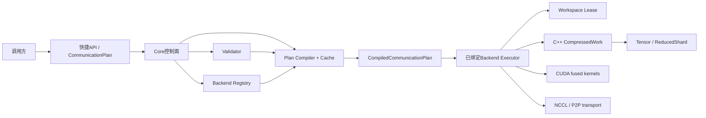
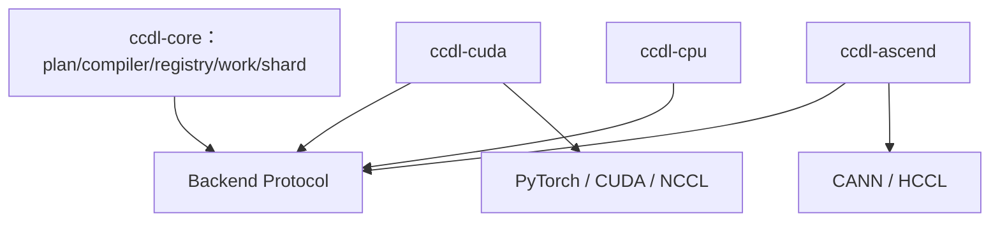

# CCDL GPU优先高性能通信库 Implementation Plan（开发实施计划）

> **For agentic workers:** REQUIRED SUB-SKILL: Use superpowers:subagent-driven-development (recommended) or superpowers:executing-plans to implement this plan task-by-task. Steps use checkbox (`- [ ]`) syntax for tracking.

**Goal:** 按照《软件需求规格说明书》和《软件设计说明书》，把当前`ccdl_comm`演进为GPU优先、性能第一、计划编译一次、后端直接执行的独立低比特通信库。

**Architecture:** 先在现有单包中建立Core控制面、Backend Protocol、Compiled Plan和CUDA Executor边界，避免过早进行多wheel迁移。稳态数据面逐步下沉到C++/CUDA，通过workspace复用、融合kernel、compressed reduce-scatter和流水化拓扑减少通信字节、Python回调、kernel launch及显存分配。

**Tech Stack:** Python 3.10+、PyTorch 2.4、CUDA 12.1、NCCL、C++17、CUDA C++、pybind11、pytest、torchrun、NVIDIA RTX A6000 2/4卡。

## Global Constraints

- 当前主要开发目标是NVIDIA GPU、CUDA和NCCL，Ascend只做回归保护，不与GPU性能工作争抢优先级。
- 性能是第一优先级；管理层相对直接Backend Executor调用的稳态额外开销必须低于1%。
- 策略解析、capability检查、fallback、拓扑和workspace规划只允许发生在compile或cache miss阶段。
- 显式策略不受支持且未声明fallback时必须抛出`UnsupportedCollective`，不得静默切换。
- 只有`strategy="auto"`时才允许自动选择策略。
- 稳态重复bucket执行必须达到零显式workspace分配。
- 生产异步路径不得无条件调用`torch.cuda.synchronize()`、CUDA event synchronize或blocking collective。
- INT8是首要生产路径；INT4只有在正确性、训练精度和性能同时达标后才能进入默认候选。
- 2卡、4卡和8卡只是验证切片，代码不得硬编码固定world size。
- 每个独立功能必须先写失败测试，再写最小实现，通过验证后独立提交。
- 每个性能改动必须保存原始JSON、环境信息、Git commit和完整命令。
- A6000代表性大bucket不得低于修改前版本；小bucket回退必须由显式阈值隔离。
- 当前实现阶段继续使用`ccdl_comm`单包；Core ABI稳定后才拆分`ccdl-core`、`ccdl-cuda`和`ccdl-ascend`。
- 不修改或提交仓库根目录下的`data/`数据集文件。

---

## 1. 新架构设计基线

后续开发必须先审查并冻结本节架构，不能一边实现kernel一边修改Core、Backend和Executor的职责边界。

### 1.1 总体架构



该架构只有两个运行阶段：

1. **控制面compile阶段**：解析策略、验证capability、解析显式fallback、检查shape/dtype/layout、规划chunk和workspace、绑定process group/stream/transport/kernel。
2. **数据面run阶段**：接收tensor，取得workspace lease，执行已绑定的quant/transport/dequant链，返回Work；不得重新进行策略决策。

### 1.2 依赖方向



强制依赖规则：

- Core不得导入Torch、CUDA、CANN或任何具体backend包。
- Core定义协议，backend依赖Core；Core不得反向依赖backend。
- CUDA与Ascend不得互相导入源码或构建工具。
- 快捷API可以调用Compiler；Compiled Executor的`run()`不得回到Registry或Planner。
- transport只负责通信，不负责选择策略。
- kernel只负责数值计算与buffer写入，不负责训练框架调度。

### 1.3 对象与所有权

| 对象 | 创建阶段 | 所有者 | 生命周期结束条件 |
|---|---|---|---|
| `CommunicationPlan` | 调用方初始化 | 调用方 | 调用方释放 |
| `CompiledCommunicationPlan` | compile/cache miss | compile cache或调用方 | cache淘汰且无引用 |
| `CompiledExecutor` | backend compile | Compiled Plan | Compiled Plan释放 |
| `WorkspaceLease` | run | Work | completion event完成 |
| `CompressedWork` | run | 调用方/训练框架 | wait完成且无引用 |
| `ReducedShard` | Work完成 | 调用方 | 调用方释放 |

任何workspace在Work完成前不得返回可复用池。任何Python callback最多执行一次。

### 1.4 热路径

```text
tensor
  -> executor.run()
  -> acquire preplanned workspace
  -> fused quant-pack
  -> prebound NCCL/P2P transport
  -> fused dequant-reduce-mean-EF
  -> record completion event
  -> Work(Tensor | ReducedShard)
```

热路径禁止：

- 字符串策略匹配；
- Registry查询；
- capability探测；
- fallback选择；
- process group或CUDA stream创建；
- workspace尺寸计算；
- Python逐rank反量化；
- 无条件CPU同步。

### 1.5 源码与发布架构

第一阶段保持`ccdl_comm`单一wheel，但源码内部必须遵守Core、CUDA、Ascend边界。只有Backend Protocol、Compiled Executor ABI和Work语义稳定后，才拆分：

```text
ccdl-core
ccdl-cuda
ccdl-ascend
ccdl-cpu（可选）
```

不同backend通过独立包和构建产物隔离，不通过长期Git分支隔离。

### 1.6 架构验收原则

新架构不是只靠文档验收，必须提供机器可检测的架构契约：

- Core禁用依赖扫描；
- backend交叉依赖扫描；
- Compiled Executor稳态调用计数；
- hot-path禁止调用扫描与运行时mock；
- Work/workspace所有权压力测试；
- wheel内容和依赖矩阵测试。

## 2. 审查范围与完成定义

本计划覆盖以下基线文档：

- `ccdl_comm_refactor/docs/SOFTWARE_REQUIREMENTS_ZH.md`
- `ccdl_comm_refactor/docs/SOFTWARE_DESIGN_ZH.md`

计划实施完成必须同时满足：

1. Core计划、Stage、Backend Protocol、Registry、Compiler和Compiled Executor可用。
2. 显式策略、fallback和`auto`语义可通过纯Python单测证明。
3. 现有all-reduce、reduce-scatter、all-gather、P2P和动态all-gather均可由编译后Executor调用。
4. CUDA生产路径不在每step重复解析字符串、探测capability或创建stream/process group。
5. Work可查询执行信息、传播异步错误并持有in-flight资源。
6. workspace具有容量上限、淘汰统计和stream安全所有权。
7. INT8大bucket具备融合quant-pack与融合dequant-reduce-mean-EF路径；量化侧`input + residual`融合不得慢于预分配`add(out=prepared) + inplace_quantize`基线。
8. 4卡以上存在真正返回`ReducedShard`的compressed reduce-scatter路径，不强制恢复完整梯度。
9. 2/4卡A6000正确性、性能和真实训练门槛通过。
10. 多wheel拆分不让Core硬依赖Torch、CUDA或CANN。

## 3. 目标文件边界

在多wheel拆分前，先形成以下单一职责文件：

```text
ccdl_comm_refactor/ccdl_comm/
├── plan.py                 # CommunicationPlan、CompileContext
├── stage.py                # CommunicationStage
├── execution_info.py       # ExecutionInfo和运行计数快照
├── backend.py              # Backend Protocol、BackendCapabilities
├── registry.py             # 后端和Executor工厂注册
├── compiler.py             # 严格解析、fallback、compile cache
├── executor.py             # CompiledExecutor协议和CompiledCommunicationPlan
├── work.py                 # 后端无关Work协议和Python实现
├── shard.py                # 后端无关ReducedShard元数据
├── collectives/            # 快捷API，委托给compiled executor
├── cuda/
│   ├── backend.py          # CUDA backend capability和compile入口
│   ├── compiler.py         # CUDA executor绑定及workspace规划
│   ├── executors.py        # Python过渡Executor
│   └── workspace.py        # CUDA workspace pool和stream ownership
├── csrc/
│   ├── executor/           # C++ CompressedWork和CUDA Executor
│   └── quantization/       # quant/dequant/EF融合kernel
└── communication/          # 现有transport，逐步变为Executor依赖
```

新增测试边界：

```text
ccdl_comm_refactor/tests/
├── core/
├── conformance/
├── cuda/
├── distributed/
└── benchmarks/
```

## 4. 阶段门禁

| Gate | 允许进入下一阶段的条件 | 阻断条件 |
|---|---|---|
| A0 架构冻结 | 架构文档、依赖契约、对象所有权和公开接口获审查通过 | Core/Backend/Executor职责仍有歧义 |
| G0 基线 | 本地全测通过；A6000 2/4卡基线JSON齐全 | 命令、环境或原始结果不可复现 |
| G1 Core | Core无Torch依赖；严格策略测试通过 | 显式策略仍静默fallback |
| G2 Executor | 快捷API和Compiled API结果一致；管理开销<1% | `run()`仍查询Registry或解析策略 |
| G3 CUDA生命周期 | Work/workspace异步压力测试通过 | 提前复用buffer、callback多次或隐式同步 |
| G4 Kernel | kernel正确性通过；大bucket无回退；quant侧residual融合不慢于双kernel基线 | launch减少但端到端反而变慢 |
| G5 Sharded | 4卡ReducedShard正确且优于full restore候选 | 最终仍无条件all-gather完整梯度 |
| G6 拓扑 | 2/4卡均不回退，任意world size单测通过 | 代码写死2/4/8卡 |
| G7 发布 | wheel隔离、安装矩阵和训练验收通过 | Core硬依赖Torch或后端互相依赖 |

### 4.1 建议量化验收阈值

以下数值是本计划提交审查的默认门槛；审查者修改后应写入`baseline_manifest.json`，开发过程中不得临时放宽：

| 指标 | INT8门槛 | INT4候选门槛 |
|---|---:|---:|
| `non_finite` | 0 | 0 |
| relative L2 | `<= 0.02` | `<= 0.08` |
| normalized RMSE（RMSE / reference RMS） | `<= 0.02` | `<= 0.08` |
| normalized max error（max abs / reference max abs） | `<= 0.10` | `<= 0.30` |
| 同配置sync/async relative L2 | `<= 1e-5` | `<= 1e-5` |
| 三个seed验证指标均值下降 | `<= 0.5`个百分点 | `<= 1.0`个百分点 |
| 达到目标指标step增加 | `<= 10%` | `<= 20%` |

### 4.2 建议性能判定阈值

- 每个微基准执行5轮独立进程，比较中位数；单配置延迟变异系数高于3%时结果无效并重跑。
- Compiled Plan稳态开销：相对直接Executor `<= 1%`。
- 默认大bucket快路径：相对修改前CCDL中位延迟不得回退，p95回退不得超过2%。
- 新策略进入`auto`：相对当前最佳可用策略中位延迟至少改善3%，否则只保留显式策略。
- 小bucket：若压缩路径慢于native NCCL，必须由编译期阈值选择native NCCL。
- 稳态workspace：相同bucket第2至100次执行显式allocator调用次数为0。
- 4卡sharded策略：峰值通信workspace不得包含`world_size`份完整反量化tensor。

---

### Task A0: 冻结新架构与机器可检测契约

**Files:**
- Create: `ccdl_comm_refactor/docs/ARCHITECTURE_BASELINE_ZH.md`
- Create: `ccdl_comm_refactor/docs/architecture/architecture_contract.json`
- Create: `ccdl_comm_refactor/tests/architecture/__init__.py`
- Create: `ccdl_comm_refactor/tests/architecture/test_architecture_contract.py`
- Modify: `ccdl_comm_refactor/docs/SOFTWARE_DESIGN_ZH.md`

**Interfaces:**
- Produces: 架构层、依赖方向、稳定公共类型、热路径禁用操作和所有权规则的版本化JSON契约。
- Produces: `load_architecture_contract() -> dict[str, object]`
- 后续所有Task必须满足该契约；修改契约必须单独提交架构变更并重新审查。

- [ ] **Step 1: 写失败的架构契约测试**

```python
import json
from pathlib import Path


CONTRACT = (
    Path(__file__).parents[2]
    / "docs"
    / "architecture"
    / "architecture_contract.json"
)


def load_architecture_contract() -> dict[str, object]:
    return json.loads(CONTRACT.read_text(encoding="utf-8"))


def test_architecture_contract_declares_control_data_boundary() -> None:
    contract = load_architecture_contract()
    assert contract["version"] == 1
    assert contract["control_plane_boundary"] == "CompiledCommunicationPlan"
    assert "registry_lookup" in contract["hot_path_forbidden"]
    assert "capability_probe" in contract["hot_path_forbidden"]
    assert "process_group_creation" in contract["hot_path_forbidden"]
```

- [ ] **Step 2: 运行测试并确认失败**

Run: `python -m pytest ccdl_comm_refactor/tests/architecture/test_architecture_contract.py -q`

Expected: FAIL，`architecture_contract.json`不存在。

- [ ] **Step 3: 编写架构基线和契约**

`architecture_contract.json`使用以下确定内容：

```json
{
  "version": 1,
  "control_plane_boundary": "CompiledCommunicationPlan",
  "core_modules": [
    "config",
    "exceptions",
    "plan",
    "stage",
    "execution_info",
    "backend",
    "registry",
    "compiler",
    "executor",
    "work",
    "shard"
  ],
  "core_forbidden_imports": [
    "torch",
    "ccdl_comm.cuda",
    "ccdl_comm.ascend"
  ],
  "backend_cross_imports_forbidden": true,
  "hot_path_forbidden": [
    "strategy_string_matching",
    "registry_lookup",
    "capability_probe",
    "fallback_resolution",
    "process_group_creation",
    "stream_creation",
    "workspace_shape_planning",
    "unconditional_cpu_sync"
  ],
  "workspace_release_condition": "completion_event_ready",
  "explicit_strategy_default": "strict",
  "auto_strategy_opt_in": true
}
```

`ARCHITECTURE_BASELINE_ZH.md`必须包含本计划1.1至1.6的完整设计、公共类型签名、compile/run序列、对象状态机、依赖方向、迁移顺序和被拒绝方案。

- [ ] **Step 4: 增加依赖契约扫描**

架构测试使用Python AST扫描当前已存在的`core_modules`，发现Core直接导入Torch或具体backend时失败；尚未创建的目标模块只检查契约声明，不伪造实现。

- [ ] **Step 5: 同步软件设计说明**

在`SOFTWARE_DESIGN_ZH.md`中明确`ARCHITECTURE_BASELINE_ZH.md`是实现架构契约，并删除与契约冲突的旧描述。架构变更必须同时修改两份文档。

- [ ] **Step 6: 运行架构测试**

Run: `python -m pytest ccdl_comm_refactor/tests/architecture -q`

Expected: PASS。

- [ ] **Step 7: 提交**

```bash
git add ccdl_comm_refactor/docs/ARCHITECTURE_BASELINE_ZH.md ccdl_comm_refactor/docs/architecture/architecture_contract.json ccdl_comm_refactor/docs/SOFTWARE_DESIGN_ZH.md ccdl_comm_refactor/tests/architecture
git commit -m "docs(ccdl_comm): freeze gpu communication architecture"
```

**Gate A0:** 用户确认架构边界、接口命名、依赖方向、所有权和迁移顺序后，才允许执行Task 0。

---

### Task 0: 冻结正确性与性能基线

**Files:**
- Create: `ccdl_comm_refactor/tests/__init__.py`
- Create: `ccdl_comm_refactor/tests/benchmarks/__init__.py`
- Create: `ccdl_comm_refactor/tests/benchmarks/baseline_manifest.json`
- Create: `ccdl_comm_refactor/tests/benchmarks/result_schema.py`
- Create: `ccdl_comm_refactor/tests/benchmarks/assert_performance_gate.py`
- Create: `ccdl_comm_refactor/tests/test_performance_gate.py`
- Modify: `ccdl_comm_refactor/tests/distributed/collective_perf_compare.py`
- Modify: `ccdl_comm_refactor/tests/distributed/sharded_reduce_scatter_perf.py`

**Interfaces:**
- Produces: `validate_result(payload: dict[str, object]) -> None`
- Produces: `compare_results(baseline: dict[str, object], candidate: dict[str, object], *, max_regression: float) -> list[str]`
- Produces JSON fields: `commit`, `hostname`, `gpu_name`, `cuda_version`, `torch_version`, `world_size`, `dtype`, `numel`, `strategy`, `latency_ms`, `effective_gbps`, `peak_memory_bytes`, `relative_l2`, `max_abs_error`, `rmse`, `non_finite`

- [ ] **Step 1: 写失败的结果模式测试**

```python
from tests.benchmarks.result_schema import validate_result


def test_result_schema_requires_reproducibility_fields() -> None:
    payload = {
        "commit": "1f057cc",
        "hostname": "a6000",
        "gpu_name": "NVIDIA RTX A6000",
        "cuda_version": "12.1",
        "torch_version": "2.4",
        "world_size": 4,
        "dtype": "fp16",
        "numel": 8_388_608,
        "strategy": "all_gather",
        "latency_ms": 1.0,
        "effective_gbps": 10.0,
        "peak_memory_bytes": 1,
        "relative_l2": 0.01,
        "max_abs_error": 0.01,
        "rmse": 0.001,
        "non_finite": 0,
    }
    validate_result(payload)
```

- [ ] **Step 2: 运行测试并确认失败**

Run: `python -m pytest ccdl_comm_refactor/tests/test_performance_gate.py -q`

Expected: FAIL，提示`tests.benchmarks.result_schema`不存在。

- [ ] **Step 3: 实现JSON模式和性能门禁**

```python
REQUIRED_FIELDS = {
    "commit",
    "hostname",
    "gpu_name",
    "cuda_version",
    "torch_version",
    "world_size",
    "dtype",
    "numel",
    "strategy",
    "latency_ms",
    "effective_gbps",
    "peak_memory_bytes",
    "relative_l2",
    "max_abs_error",
    "rmse",
    "non_finite",
}


def validate_result(payload: dict[str, object]) -> None:
    missing = REQUIRED_FIELDS.difference(payload)
    if missing:
        raise ValueError(f"missing benchmark fields: {sorted(missing)}")


def compare_results(
    baseline: dict[str, object],
    candidate: dict[str, object],
    *,
    max_regression: float,
) -> list[str]:
    ratio = float(candidate["latency_ms"]) / float(baseline["latency_ms"])
    return [] if ratio <= 1.0 + max_regression else [f"latency regression: {ratio:.4f}"]
```

- [ ] **Step 4: 本地回归**

Run: `python -m pytest ccdl_comm_refactor/tests/test_performance_gate.py ccdl_comm_refactor/tests/test_collective_perf_script.py ccdl_comm_refactor/tests/test_sharded_reduce_scatter_perf_script.py -q`

Expected: PASS。

- [ ] **Step 5: 采集A6000基线**

```bash
cd /home/user/wangjun/lowbit_comm/ccdl_comm_refactor
mkdir -p tests/benchmarks/reports/gpu_first_baseline/raw
for nproc in 2 4; do
  for dtype in fp16 bf16; do
    for numel in 524288 8388608 33554432; do
      torchrun --standalone --nproc-per-node=${nproc} \
        tests/distributed/collective_perf_compare.py \
        --dtype=${dtype} --numel=${numel} --bit=8 --group-size=64 \
        --warmup=20 --repeat=100 \
        --output-json=tests/benchmarks/reports/gpu_first_baseline/raw/${nproc}gpu_${dtype}_${numel}.json
    done
  done
done
```

Expected: 12个JSON全部通过schema检查；每个rank无非有限值。

- [ ] **Step 6: 提交**

```bash
git add ccdl_comm_refactor/tests/benchmarks ccdl_comm_refactor/tests/distributed/collective_perf_compare.py ccdl_comm_refactor/tests/distributed/sharded_reduce_scatter_perf.py ccdl_comm_refactor/tests/test_performance_gate.py
git commit -m "test(ccdl_comm): establish gpu performance gates"
```

**Gate G0:** 基线原始JSON、运行命令和环境信息齐全。

---

### Task 1: 建立不可变Core数据模型

**Files:**
- Create: `ccdl_comm_refactor/ccdl_comm/plan.py`
- Create: `ccdl_comm_refactor/ccdl_comm/stage.py`
- Create: `ccdl_comm_refactor/ccdl_comm/execution_info.py`
- Create: `ccdl_comm_refactor/ccdl_comm/work.py`
- Create: `ccdl_comm_refactor/ccdl_comm/shard.py`
- Create: `ccdl_comm_refactor/tests/core/test_plan.py`
- Create: `ccdl_comm_refactor/tests/core/test_stage.py`
- Create: `ccdl_comm_refactor/tests/core/test_execution_info.py`
- Create: `ccdl_comm_refactor/tests/core/test_work_protocol.py`
- Create: `ccdl_comm_refactor/tests/core/test_reduced_shard.py`
- Modify: `ccdl_comm_refactor/ccdl_comm/config.py`
- Modify: `ccdl_comm_refactor/ccdl_comm/__init__.py`
- Modify: `ccdl_comm_refactor/ccdl_comm/collectives/work.py`
- Modify: `ccdl_comm_refactor/ccdl_comm/collectives/reduce_scatter.py`
- Modify: `ccdl_comm_refactor/tests/test_config.py`

**Interfaces:**
- Produces: `WorkspacePolicy`
- Produces: `CommunicationStage`
- Produces: `CommunicationPlan`
- Produces: `CompileContext`
- Produces: `ExecutionInfo`
- Produces: `CollectiveWork`
- Produces: `ReducedShard`
- Consumes: `CompressionConfig`

- [ ] **Step 1: 写不可变性与验证失败测试**

```python
import pytest

from ccdl_comm import CommunicationPlan, CommunicationStage, CompileContext


def test_plan_is_immutable_and_requires_explicit_strategy() -> None:
    plan = CommunicationPlan(collective="all_reduce", strategy="ring")
    with pytest.raises(Exception):
        plan.strategy = "auto"


def test_hierarchical_plan_requires_stages() -> None:
    with pytest.raises(ValueError, match="requires at least one stage"):
        CommunicationPlan(collective="all_reduce", strategy="hierarchical")


def test_context_rejects_rank_outside_world() -> None:
    with pytest.raises(ValueError, match="rank must be"):
        CompileContext(rank=4, world_size=4, device="cuda:0", shape=(1024,), dtype="float16")
```

- [ ] **Step 2: 确认测试失败**

Run: `python -m pytest ccdl_comm_refactor/tests/core/test_plan.py ccdl_comm_refactor/tests/core/test_execution_info.py -q`

Expected: FAIL，公共类型尚未定义。

- [ ] **Step 3: 实现数据模型**

```python
@dataclass(frozen=True)
class CommunicationStage:
    name: str
    collective: str
    strategy: str
    backend: str = "cuda"
    compression: CompressionConfig | None = None
    process_group: object | None = None
    output_layout: str = "full"
    async_op: bool = True


@dataclass(frozen=True)
class WorkspacePolicy:
    cache: bool = True
    max_cached_bytes: int | None = None
    max_entries: int | None = None
    stream_safe: bool = True


@dataclass(frozen=True)
class CommunicationPlan:
    collective: str
    strategy: str
    backend: str = "cuda"
    compression: CompressionConfig | None = None
    stages: tuple[CommunicationStage, ...] = ()
    fallback: tuple[str, ...] = ()
    output_layout: str = "full"
    async_op: bool = True
    workspace_policy: WorkspacePolicy = WorkspacePolicy()


@dataclass(frozen=True)
class CompileContext:
    rank: int
    world_size: int
    device: str
    shape: tuple[int, ...]
    dtype: str
    layout: str = "contiguous"
    local_rank: int | None = None
    local_world_size: int | None = None
    node_id: int | None = None
    node_count: int | None = None
    process_group: object | None = None
    process_groups: Mapping[str, object] = field(default_factory=dict)
    topology_signature: str = "unknown"
    workspace_budget_bytes: int | None = None
    allow_dynamic_shape: bool = False
```

`ExecutionInfo`必须包含需求FR-015全部静态字段，并用`MappingProxyType`或不可变tuple保存扩展数据。

- [ ] **Step 4: 提取后端无关Work与ReducedShard**

把现有`collectives/work.py`中的Work实现移动到顶层`work.py`，把现有`collectives/reduce_scatter.py`中的`ReducedShard`移动到顶层`shard.py`。迁移阶段原模块只做重导出，确保内部调用逐步切换而不复制实现。

`ReducedShard`不得包含Torch类型判断或ParaScale专用逻辑，必须保留现有`logical_range`、`valid_numel`、`padding_numel`和`to_metadata()`语义。

- [ ] **Step 5: 将CompressionConfig扩展为独立通信目标**

保留现有字段，并把`target`从只允许`ddp_gradient_bucket`扩展为：

```python
SUPPORTED_TARGETS = {
    "tensor",
    "ddp_gradient_bucket",
    "collective",
    "p2p",
}
```

默认值改为`"tensor"`；DDP hook构造配置时显式传入`target="ddp_gradient_bucket"`。

- [ ] **Step 6: 运行Core测试**

Run: `python -m pytest ccdl_comm_refactor/tests/core ccdl_comm_refactor/tests/test_config.py -q`

Expected: PASS。

- [ ] **Step 7: 验证Core导入不加载Torch**

Run:

```bash
python -c "import sys, ccdl_comm.plan, ccdl_comm.execution_info, ccdl_comm.work, ccdl_comm.shard; assert 'torch' not in sys.modules"
```

Expected: exit 0。

- [ ] **Step 8: 提交**

```bash
git add ccdl_comm_refactor/ccdl_comm/plan.py ccdl_comm_refactor/ccdl_comm/stage.py ccdl_comm_refactor/ccdl_comm/execution_info.py ccdl_comm_refactor/ccdl_comm/work.py ccdl_comm_refactor/ccdl_comm/shard.py ccdl_comm_refactor/ccdl_comm/config.py ccdl_comm_refactor/ccdl_comm/__init__.py ccdl_comm_refactor/ccdl_comm/collectives/work.py ccdl_comm_refactor/ccdl_comm/collectives/reduce_scatter.py ccdl_comm_refactor/tests/core ccdl_comm_refactor/tests/test_config.py
git commit -m "feat(ccdl_comm): define immutable communication plans"
```

---

### Task 2: Backend Protocol与四维Registry

**Files:**
- Create: `ccdl_comm_refactor/ccdl_comm/backend.py`
- Create: `ccdl_comm_refactor/ccdl_comm/registry.py`
- Create: `ccdl_comm_refactor/ccdl_comm/executor.py`
- Modify: `ccdl_comm_refactor/ccdl_comm/capability.py`
- Create: `ccdl_comm_refactor/tests/core/test_backend_protocol.py`
- Create: `ccdl_comm_refactor/tests/core/test_registry.py`
- Modify: `ccdl_comm_refactor/tests/test_capability.py`
- Modify: `ccdl_comm_refactor/ccdl_comm/exceptions.py`

**Interfaces:**
- Produces: `BackendCapabilities`
- Produces: `CommunicationBackend`
- Produces: `CompiledExecutor`
- Produces: `BackendRegistry.register(key, factory)`
- Produces: `BackendRegistry.resolve(key)`
- Registry key: `(collective, strategy, backend, output_layout)`

- [ ] **Step 1: 写注册冲突和查找失败测试**

```python
import pytest

from ccdl_comm.exceptions import BackendRegistrationError, UnsupportedCollective
from ccdl_comm.registry import BackendKey, BackendRegistry


def test_registry_rejects_duplicate_key() -> None:
    registry = BackendRegistry()
    key = BackendKey("all_reduce", "ring", "cuda", "full")
    registry.register(key, lambda: object())
    with pytest.raises(BackendRegistrationError):
        registry.register(key, lambda: object())


def test_registry_missing_key_is_diagnostic() -> None:
    registry = BackendRegistry()
    with pytest.raises(UnsupportedCollective, match="all_reduce:ring:cuda:full"):
        registry.resolve(BackendKey("all_reduce", "ring", "cuda", "full"))
```

- [ ] **Step 2: 确认测试失败**

Run: `python -m pytest ccdl_comm_refactor/tests/core/test_backend_protocol.py ccdl_comm_refactor/tests/core/test_registry.py -q`

Expected: FAIL。

- [ ] **Step 3: 实现协议和Registry**

```python
@dataclass(frozen=True)
class BackendKey:
    collective: str
    strategy: str
    backend: str
    output_layout: str


class CommunicationBackend(Protocol):
    name: str
    abi_version: int

    def capabilities(self, context: CompileContext) -> BackendCapabilities:
        ...

    def compile(
        self,
        plan: CommunicationPlan,
        context: CompileContext,
    ) -> CompiledExecutor:
        ...
```

Registry内部使用`dict[BackendKey, Callable[[], CommunicationBackend]]`，只允许控制面访问。

纯数据`BackendCapabilities`定义在`backend.py`中；现有`capability.py`保留为运行时能力探测与迁移适配层，把`CapabilityReport`规范化为该Core类型，避免Core反向依赖Torch或具体设备后端。`executor.py`在本Task先提供最小协议，Task 4在同一文件增加Compiled Plan：

```python
class CompiledExecutor(Protocol):
    execution_info: ExecutionInfo

    def run(self, tensor: object) -> CollectiveWork[object]:
        ...
```

- [ ] **Step 4: 运行Core测试**

Run: `python -m pytest ccdl_comm_refactor/tests/core -q`

Expected: PASS。

- [ ] **Step 5: 提交**

```bash
git add ccdl_comm_refactor/ccdl_comm/backend.py ccdl_comm_refactor/ccdl_comm/registry.py ccdl_comm_refactor/ccdl_comm/executor.py ccdl_comm_refactor/ccdl_comm/capability.py ccdl_comm_refactor/ccdl_comm/exceptions.py ccdl_comm_refactor/tests/core ccdl_comm_refactor/tests/test_capability.py
git commit -m "feat(ccdl_comm): add backend protocol registry"
```

---

### Task 3: 严格策略解析与显式fallback

**Files:**
- Create: `ccdl_comm_refactor/ccdl_comm/compiler.py`
- Create: `ccdl_comm_refactor/tests/core/test_compiler_resolution.py`
- Modify: `ccdl_comm_refactor/ccdl_comm/communication/strategy.py`
- Modify: `ccdl_comm_refactor/tests/test_strategy_planner.py`

**Interfaces:**
- Produces: `resolve_plan(plan, context, registry) -> ResolvedPlan`
- Produces: `ResolvedPlan.requested_strategy`
- Produces: `ResolvedPlan.executed_strategy`
- Produces: `ResolvedPlan.fallback_used`
- Produces: `ResolvedPlan.fallback_reason`

- [ ] **Step 1: 写严格语义测试**

```python
import pytest

from ccdl_comm import CommunicationPlan, CompileContext
from ccdl_comm.compiler import resolve_plan
from ccdl_comm.exceptions import UnsupportedCollective
from ccdl_comm.registry import BackendRegistry


CONTEXT = CompileContext(
    rank=0,
    world_size=4,
    device="cuda:0",
    shape=(1024,),
    dtype="float16",
)


def test_explicit_unsupported_strategy_does_not_silently_fallback() -> None:
    plan = CommunicationPlan(collective="all_reduce", strategy="ring")
    with pytest.raises(UnsupportedCollective):
        resolve_plan(plan, CONTEXT, BackendRegistry())


def test_explicit_fallback_uses_first_supported_entry() -> None:
    registry = BackendRegistry()
    registry.register(
        BackendKey("all_reduce", "all_gather", "cuda", "full"),
        lambda: object(),
    )
    plan = CommunicationPlan(
        collective="all_reduce",
        strategy="ring",
        fallback=("all_gather",),
    )
    resolved = resolve_plan(plan, CONTEXT, registry)
    assert resolved.executed_strategy == "all_gather"
    assert resolved.fallback_used is True
```

- [ ] **Step 2: 确认现有静默fallback测试失败**

Run: `python -m pytest ccdl_comm_refactor/tests/core/test_compiler_resolution.py ccdl_comm_refactor/tests/test_strategy_planner.py -q`

Expected: FAIL；现有`plan_ddp_compression_strategy()`仍会为不支持的显式策略返回all-gather。

- [ ] **Step 3: 实现严格解析**

解析顺序固定为：

```python
if requested_key in registry:
    return resolved(requested)
for fallback in plan.fallback:
    if fallback_key in registry:
        return resolved(fallback, fallback_reason="explicit fallback")
if plan.strategy == "auto":
    return auto_planner.resolve(plan, context, registry)
raise UnsupportedCollective(
    f"{plan.collective}:{plan.strategy}",
    reason="explicit strategy unavailable and no supported fallback was declared",
)
```

- [ ] **Step 4: 修正旧planner测试预期**

显式`hierarchical`、`reduce_scatter`和`topology`缺少capability时必须抛异常；仅`auto`返回可解释fallback。

- [ ] **Step 5: 运行测试**

Run: `python -m pytest ccdl_comm_refactor/tests/core/test_compiler_resolution.py ccdl_comm_refactor/tests/test_strategy_planner.py -q`

Expected: PASS。

- [ ] **Step 6: 提交**

```bash
git add ccdl_comm_refactor/ccdl_comm/compiler.py ccdl_comm_refactor/ccdl_comm/communication/strategy.py ccdl_comm_refactor/tests/core/test_compiler_resolution.py ccdl_comm_refactor/tests/test_strategy_planner.py
git commit -m "fix(ccdl_comm): enforce explicit strategy semantics"
```

**Gate G1:** Core不导入Torch，显式策略不再静默回退。

---

### Task 4: Compiled Plan、Executor协议与编译缓存

**Files:**
- Modify: `ccdl_comm_refactor/ccdl_comm/executor.py`
- Create: `ccdl_comm_refactor/tests/core/test_compiled_executor.py`
- Create: `ccdl_comm_refactor/tests/core/test_compile_cache.py`
- Modify: `ccdl_comm_refactor/ccdl_comm/compiler.py`
- Modify: `ccdl_comm_refactor/ccdl_comm/__init__.py`

**Interfaces:**
- Produces: `CompiledExecutor.run(tensor) -> CollectiveWork`
- Produces: `CompiledCommunicationPlan`
- Produces: `compile(plan, context, *, registry=None, cache=None)`
- Produces: `CompileCache`

- [ ] **Step 1: 写一次编译、多次运行测试**

```python
def test_compiled_plan_does_not_resolve_backend_on_run() -> None:
    backend = FakeBackend()
    registry = BackendRegistry()
    registry.register(
        BackendKey("all_reduce", "ring", "fake", "full"),
        lambda: backend,
    )
    plan = CommunicationPlan("all_reduce", "ring", backend="fake")
    compiled = compile(plan, CONTEXT, registry=registry)

    assert compiled.run("a").wait() == "a"
    assert compiled.run("b").wait() == "b"
    assert backend.compile_calls == 1
    assert backend.run_calls == 2
```

- [ ] **Step 2: 写缓存键测试**

shape、dtype、world size、process group identity、bit、group size、layout、topology signature和workspace policy任一变化必须cache miss；相同shape class必须命中。

- [ ] **Step 3: 确认测试失败**

Run: `python -m pytest ccdl_comm_refactor/tests/core/test_compiled_executor.py ccdl_comm_refactor/tests/core/test_compile_cache.py -q`

Expected: FAIL。

- [ ] **Step 4: 实现Compiled Plan**

```python
@dataclass(frozen=True)
class CompiledCommunicationPlan:
    executor: CompiledExecutor
    execution_info: ExecutionInfo
    cache_key: CompileCacheKey

    def run(self, tensor: object) -> CollectiveWork[object]:
        return self.executor.run(tensor)
```

缓存使用有界LRU；process group使用稳定identity对象，不使用可变字符串表示。

- [ ] **Step 5: 运行Core全测**

Run: `python -m pytest ccdl_comm_refactor/tests/core -q`

Expected: PASS。

- [ ] **Step 6: 提交**

```bash
git add ccdl_comm_refactor/ccdl_comm/executor.py ccdl_comm_refactor/ccdl_comm/compiler.py ccdl_comm_refactor/ccdl_comm/__init__.py ccdl_comm_refactor/tests/core
git commit -m "feat(ccdl_comm): compile reusable communication executors"
```

---

### Task 5: CUDA Backend适配现有生产路径

**Files:**
- Create: `ccdl_comm_refactor/ccdl_comm/cuda/backend.py`
- Create: `ccdl_comm_refactor/ccdl_comm/cuda/compiler.py`
- Create: `ccdl_comm_refactor/ccdl_comm/cuda/executors.py`
- Create: `ccdl_comm_refactor/tests/cuda/test_cuda_backend_compile.py`
- Create: `ccdl_comm_refactor/tests/conformance/test_cuda_backend.py`
- Modify: `ccdl_comm_refactor/ccdl_comm/cuda/__init__.py`
- Modify: `ccdl_comm_refactor/ccdl_comm/collectives/all_reduce.py`
- Modify: `ccdl_comm_refactor/ccdl_comm/collectives/reduce_scatter.py`

**Interfaces:**
- Produces: `CudaCommunicationBackend`
- Produces: `CudaAllReduceExecutor`
- Produces: `CudaReducedShardExecutor`
- Consumes existing transports and codecs without复制实现。

- [ ] **Step 1: 写Backend conformance测试**

```python
def test_cuda_backend_compiles_supported_int8_all_reduce(fake_cuda_context) -> None:
    backend = CudaCommunicationBackend(extension_status=fake_extension())
    executor = backend.compile(
        CommunicationPlan(
            "all_reduce",
            "all_gather",
            compression=CompressionConfig(bit=8),
        ),
        fake_cuda_context,
    )
    assert executor.execution_info.backend == "cuda"
    assert executor.execution_info.executed_strategy == "all_gather"
```

- [ ] **Step 2: 确认测试失败**

Run: `python -m pytest ccdl_comm_refactor/tests/cuda/test_cuda_backend_compile.py ccdl_comm_refactor/tests/conformance/test_cuda_backend.py -q`

Expected: FAIL。

- [ ] **Step 3: 绑定现有transport**

编译阶段选择并保存以下callable：

```python
strategy_builders = {
    ("all_reduce", "all_gather", "full"): build_all_gather_executor,
    ("all_reduce", "topology", "full"): build_topology_executor,
    ("reduce_scatter", "compressed", "shard"): build_reduced_shard_executor,
    ("all_reduce", "hierarchical", "full"): build_hierarchical_executor,
}
```

Executor构造时绑定quantizer、dequantizer、process group、stream、workspace key和transport；`run()`只接受tensor。

- [ ] **Step 4: 快捷API改为compile-once适配**

快捷API允许无缓存的一次性调用，但DDP hook和高频调用方必须持有Compiled Plan。现有参数注入路径保留给测试，不进入默认生产Executor。

- [ ] **Step 5: 运行回归**

Run:

```bash
python -m pytest \
  ccdl_comm_refactor/tests/cuda \
  ccdl_comm_refactor/tests/conformance \
  ccdl_comm_refactor/tests/test_collectives_api.py \
  ccdl_comm_refactor/tests/test_reduce_scatter_api.py \
  ccdl_comm_refactor/tests/test_compressed_all_reduce.py -q
```

Expected: PASS。

- [ ] **Step 6: 提交**

```bash
git add ccdl_comm_refactor/ccdl_comm/cuda ccdl_comm_refactor/ccdl_comm/collectives ccdl_comm_refactor/tests/cuda ccdl_comm_refactor/tests/conformance
git commit -m "feat(ccdl_comm): compile cuda communication executors"
```

---

### Task 6: ExecutionInfo贯穿Compiled Plan与Work

**Files:**
- Modify: `ccdl_comm_refactor/ccdl_comm/work.py`
- Modify: `ccdl_comm_refactor/ccdl_comm/collectives/work.py`
- Modify: `ccdl_comm_refactor/ccdl_comm/execution_info.py`
- Modify: `ccdl_comm_refactor/ccdl_comm/cuda/executors.py`
- Create: `ccdl_comm_refactor/tests/core/test_work_execution_info.py`
- Modify: `ccdl_comm_refactor/tests/test_cuda_completion.py`

**Interfaces:**
- Produces: `CollectiveWork.execution_info`
- Produces: `ExecutionCounters.snapshot()`
- 保证`query()`不执行callback、不同步CPU。

- [ ] **Step 1: 写Work行为测试**

```python
def test_query_is_observational_and_callback_runs_once() -> None:
    callbacks = []
    work = CompletionWork(
        result=None,
        handle=ReadyHandle(),
        complete=lambda: callbacks.append("done") or 7,
        execution_info=INFO,
    )
    assert work.query() is False
    assert callbacks == []
    assert work.wait() == 7
    assert work.wait() == 7
    assert callbacks == ["done"]
    assert work.execution_info is INFO
```

- [ ] **Step 2: 确认测试失败**

Run: `python -m pytest ccdl_comm_refactor/tests/core/test_work_execution_info.py ccdl_comm_refactor/tests/test_cuda_completion.py -q`

Expected: FAIL，`CompletionWork`尚不接受`execution_info`。

- [ ] **Step 3: 实现只读信息和轻量计数**

运行阶段只允许更新预分配计数器中的整数；字符串、fallback reason和stage名称在编译期固定。

- [ ] **Step 4: 运行测试**

Run: `python -m pytest ccdl_comm_refactor/tests/core/test_work_execution_info.py ccdl_comm_refactor/tests/test_cuda_completion.py -q`

Expected: PASS。

- [ ] **Step 5: 提交**

```bash
git add ccdl_comm_refactor/ccdl_comm/work.py ccdl_comm_refactor/ccdl_comm/collectives/work.py ccdl_comm_refactor/ccdl_comm/execution_info.py ccdl_comm_refactor/ccdl_comm/cuda/executors.py ccdl_comm_refactor/tests/core/test_work_execution_info.py ccdl_comm_refactor/tests/test_cuda_completion.py
git commit -m "feat(ccdl_comm): expose compiled execution metadata"
```

---

### Task 7: 测量并限制管理层热路径开销

**Files:**
- Create: `ccdl_comm_refactor/tests/distributed/executor_overhead_perf.py`
- Create: `ccdl_comm_refactor/tests/test_executor_overhead_perf_script.py`
- Modify: `ccdl_comm_refactor/tests/benchmarks/assert_performance_gate.py`

**Interfaces:**
- Produces JSON: `direct_executor_us`, `compiled_plan_us`, `overhead_ratio`, `compile_us`, `cache_hit`

- [ ] **Step 1: 写benchmark脚本契约测试**

脚本必须接受`--iterations`、`--warmup`、`--numel`和`--output-json`，并拒绝把compile时间计入稳态run时间。

- [ ] **Step 2: 实现CUDA Event计时**

```python
start.record()
for _ in range(args.iterations):
    compiled.run(tensor)
end.record()
end.synchronize()
elapsed_us = start.elapsed_time(end) * 1000 / args.iterations
```

同步只允许出现在benchmark边界。

- [ ] **Step 3: 本地脚本测试**

Run: `python -m pytest ccdl_comm_refactor/tests/test_executor_overhead_perf_script.py -q`

Expected: PASS。

- [ ] **Step 4: A6000门禁**

```bash
torchrun --standalone --nproc-per-node=2 \
  tests/distributed/executor_overhead_perf.py \
  --numel=8388608 --warmup=100 --iterations=1000 \
  --output-json=tests/benchmarks/reports/executor_overhead/2gpu.json
python tests/benchmarks/assert_performance_gate.py \
  --candidate tests/benchmarks/reports/executor_overhead/2gpu.json \
  --metric overhead_ratio --max 1.01
```

Expected: `overhead_ratio <= 1.01`。

- [ ] **Step 5: 提交**

```bash
git add ccdl_comm_refactor/tests/distributed/executor_overhead_perf.py ccdl_comm_refactor/tests/test_executor_overhead_perf_script.py ccdl_comm_refactor/tests/benchmarks/assert_performance_gate.py
git commit -m "perf(ccdl_comm): gate compiled executor overhead"
```

**Gate G2:** 快捷API和Compiled API正确性一致，稳态管理开销不超过1%。

---

### Task 8: 统一workspace pool、预算和stream ownership

**Files:**
- Create: `ccdl_comm_refactor/ccdl_comm/cuda/workspace.py`
- Modify: `ccdl_comm_refactor/ccdl_comm/communication/workspace.py`
- Create: `ccdl_comm_refactor/tests/cuda/test_cuda_workspace_pool.py`
- Modify: `ccdl_comm_refactor/tests/test_workspace_cache.py`
- Modify: `ccdl_comm_refactor/tests/test_async_shard_pipeline.py`

**Interfaces:**
- Produces: `WorkspaceKey`
- Produces: `CudaWorkspacePool.acquire(key, stream) -> WorkspaceLease`
- Produces: `WorkspaceStats(hits, misses, evictions, cached_bytes, in_flight_bytes)`
- Lease在completion event完成前禁止返回空闲池。

- [ ] **Step 1: 写预算与in-flight测试**

```python
def test_in_flight_workspace_is_not_reused() -> None:
    pool = CudaWorkspacePool(allocator=fake_allocator, max_cached_bytes=4096)
    first = pool.acquire(KEY, stream="s0")
    second = pool.acquire(KEY, stream="s1")
    assert second.buffer is not first.buffer
    first.release(completion=ReadyEvent())
    third = pool.acquire(KEY, stream="s2")
    assert third.buffer is first.buffer
```

- [ ] **Step 2: 确认测试失败**

Run: `python -m pytest ccdl_comm_refactor/tests/cuda/test_cuda_workspace_pool.py ccdl_comm_refactor/tests/test_workspace_cache.py -q`

Expected: FAIL。

- [ ] **Step 3: 实现统一key和LRU**

`WorkspaceKey`必须包含backend、collective、strategy、shape class、dtype、world size、bit、group size、chunk config和workspace kind。

- [ ] **Step 4: 加入allocator stream记录**

真实CUDA buffer释放或复用前调用PyTorch allocator支持的`record_stream()`；测试fake buffer记录调用次数。

- [ ] **Step 5: 重复bucket零分配测试**

连续运行100次相同Compiled Plan，断言allocator只调用一次，`stats.hits == 99`。

- [ ] **Step 6: 运行测试**

Run: `python -m pytest ccdl_comm_refactor/tests/cuda/test_cuda_workspace_pool.py ccdl_comm_refactor/tests/test_workspace_cache.py ccdl_comm_refactor/tests/test_async_shard_pipeline.py -q`

Expected: PASS。

- [ ] **Step 7: 提交**

```bash
git add ccdl_comm_refactor/ccdl_comm/cuda/workspace.py ccdl_comm_refactor/ccdl_comm/communication/workspace.py ccdl_comm_refactor/tests/cuda/test_cuda_workspace_pool.py ccdl_comm_refactor/tests/test_workspace_cache.py ccdl_comm_refactor/tests/test_async_shard_pipeline.py
git commit -m "perf(ccdl_comm): pool stream-safe cuda workspaces"
```

---

### Task 9: 将Work完成链下沉到C++

**Files:**
- Create: `ccdl_comm_refactor/ccdl_comm/csrc/executor/compressed_work.h`
- Create: `ccdl_comm_refactor/ccdl_comm/csrc/executor/compressed_work.cpp`
- Create: `ccdl_comm_refactor/ccdl_comm/csrc/executor/cuda_executor.h`
- Create: `ccdl_comm_refactor/ccdl_comm/csrc/executor/cuda_executor.cpp`
- Modify: `ccdl_comm_refactor/ccdl_comm/csrc/pybind.cpp`
- Modify: `ccdl_comm_refactor/ccdl_comm/build/extension.py`
- Create: `ccdl_comm_refactor/tests/cuda/test_native_work.py`
- Modify: `ccdl_comm_refactor/tests/test_pybind_exports.py`

**Interfaces:**
- Produces pybind class: `CompressedWork`
- Produces: `wait()`, `query()`, `get_future()`, `result()`
- C++对象持有payload、workspace、CUDA event和transport work。

- [ ] **Step 1: 写pybind导出失败测试**

```python
def test_cuda_extension_exports_native_work(extension) -> None:
    assert hasattr(extension, "CompressedWork")
    assert hasattr(extension, "create_cuda_executor")
```

- [ ] **Step 2: 确认测试失败**

Run: `python -m pytest ccdl_comm_refactor/tests/test_pybind_exports.py ccdl_comm_refactor/tests/cuda/test_native_work.py -q`

Expected: FAIL。

- [ ] **Step 3: 实现C++生命周期骨架**

```cpp
class CompressedWork {
 public:
  bool query() const;
  at::Tensor wait();
  py::object get_future() const;

 private:
  std::vector<at::Tensor> resources_;
  std::shared_ptr<c10d::Work> transport_work_;
  at::cuda::CUDAEvent completion_;
  bool callback_finished_{false};
};
```

`query()`只查询c10d work和CUDA event，不调用synchronize。

- [ ] **Step 4: extension缺失fallback**

CUDA扩展未加载时，`ccdl_comm`仍可安全import，Compiler明确记录`fast_path="python_fallback"`。

- [ ] **Step 5: 构建和测试**

```bash
CCDL_BUILD_CUDA=1 python -m pip install -e . --no-build-isolation
python -m pytest tests/test_pybind_exports.py tests/cuda/test_native_work.py tests/test_cuda_extension_smoke.py -q
```

Expected: PASS。

- [ ] **Step 6: 提交**

```bash
git add ccdl_comm_refactor/ccdl_comm/csrc/executor ccdl_comm_refactor/ccdl_comm/csrc/pybind.cpp ccdl_comm_refactor/ccdl_comm/build/extension.py ccdl_comm_refactor/tests/cuda/test_native_work.py ccdl_comm_refactor/tests/test_pybind_exports.py
git commit -m "feat(ccdl_comm): add native cuda communication work"
```

**Gate G3:** Work异常、重复wait、query和workspace生命周期压力测试通过。

---

### Task 10: Fused quant-pack与输出workspace复用

**Files:**
- Create: `ccdl_comm_refactor/ccdl_comm/csrc/quantization/quant_pack_kernel.cu`
- Modify: `ccdl_comm_refactor/ccdl_comm/csrc/quantization/quant_api.cuh`
- Modify: `ccdl_comm_refactor/ccdl_comm/csrc/pybind.cpp`
- Modify: `ccdl_comm_refactor/ccdl_comm/quantization/codec.py`
- Create: `ccdl_comm_refactor/tests/cuda/test_fused_quant_pack.py`
- Modify: `ccdl_comm_refactor/tests/distributed/cuda_codec_perf.py`

**Interfaces:**
- Produces: `inplace_quantize_pack(input, output, residual, config, metadata)`
- 不返回新分配payload。

- [ ] **Step 1: 写kernel正确性测试**

测试FP16/BF16/FP32、非整除group、空tensor、INT8和实验INT4；对比现有`quantize_tensor()`payload逐字节一致或反量化误差等价。

- [ ] **Step 2: 写分配测试**

预分配output重复调用100次，断言data pointer不变，CUDA memory allocated不增长。

- [ ] **Step 3: 确认测试失败**

Run: `python -m pytest ccdl_comm_refactor/tests/cuda/test_fused_quant_pack.py -q`

Expected: FAIL，extension无`inplace_quantize_pack`。

- [ ] **Step 4: 实现单主kernel launch**

kernel一次完成：

```text
prepared = input + residual（EF启用时）
group min/max或scale
低比特编码
compact pack
metadata写入
```

不在kernel内执行跨rank通信。

- [ ] **Step 5: A6000 codec门禁**

```bash
python tests/distributed/cuda_codec_perf.py \
  --numel=8388608 --dtype=fp16 --bit=8 --group-size=64 \
  --warmup=100 --repeat=1000 \
  --output-json=tests/benchmarks/reports/fused_quant_pack/fp16_8m.json
```

Expected: 8M元素量化延迟不高于当前kernel，显式分配次数为0。

- [ ] **Step 6: 提交**

```bash
git add ccdl_comm_refactor/ccdl_comm/csrc/quantization/quant_pack_kernel.cu ccdl_comm_refactor/ccdl_comm/csrc/quantization/quant_api.cuh ccdl_comm_refactor/ccdl_comm/csrc/pybind.cpp ccdl_comm_refactor/ccdl_comm/quantization/codec.py ccdl_comm_refactor/tests/cuda/test_fused_quant_pack.py ccdl_comm_refactor/tests/distributed/cuda_codec_perf.py
git commit -m "perf(ccdl_comm): fuse quantization payload packing"
```

---

### Task 10.1: 优化quant侧residual融合并行度

Task 10在A6000上的已知基线：8,388,608个FP16元素、INT8、group size 64、100次warmup和1000次repeat时，单kernel `input + residual + quant-pack`为`0.17072 ms`，预分配`torch.add(out=prepared) + inplace_quantize`为`0.15477 ms`，候选慢约`10.3%`。该回退不得被后续通信耗时掩盖。

**Files:**
- Modify: `ccdl_comm_refactor/ccdl_comm/csrc/quantization/quant_pack_kernel.cu`
- Modify: `ccdl_comm_refactor/ccdl_comm/csrc/quantization/quant_api.cuh`
- Modify: `ccdl_comm_refactor/ccdl_comm/quantization/codec.py`
- Modify: `ccdl_comm_refactor/tests/cuda/test_fused_quant_pack.py`
- Modify: `ccdl_comm_refactor/tests/distributed/cuda_codec_perf.py`
- Create: `ccdl_comm_refactor/tests/benchmarks/fused_quant_pack_gate.py`

**Interfaces:**
- Consumes: `inplace_quantize_pack(input, output, residual, group_size, topk, stochastic, bit, quant_type, compact) -> bool`
- Produces: 同一ABI；优化只改变kernel内部线程映射，不改变payload布局、fallback或workspace所有权。
- Baseline: `torch.add(input, residual, out=prepared)`后调用现有`inplace_quantize(prepared, output, ...)`，`prepared`和`output`均须在计时前分配。

- [ ] **Step 1: 固化性能回退测试和门禁解析器**

在`fused_quant_pack_gate.py`实现：

```python
def evaluate(candidate_ms: float, baseline_ms: float) -> list[str]:
    if candidate_ms > baseline_ms:
        return [f"residual quant-pack regression: {candidate_ms:.6f} > {baseline_ms:.6f} ms"]
    return []
```

测试必须证明`0.17072 ms`候选相对`0.15477 ms`基线会被拒绝，同时相等或更快的候选通过。

- [ ] **Step 2: 写kernel线程映射正确性测试**

扩展`test_fused_quant_pack.py`，参数化FP16/BF16/FP32、INT8/实验INT4、group size 16/32/64、非整除numel和非零residual。每组结果必须与`quantize_tensor(input + residual)`逐字节一致，且不得修改input或residual。

- [ ] **Step 3: 确认性能门禁先失败**

Run:

```bash
python tests/benchmarks/fused_quant_pack_gate.py \
  --baseline-ms=0.15477 --candidate-ms=0.17072
```

Expected: 非零退出，报告`residual quant-pack regression`。

- [ ] **Step 4: 将每group单线程串行路径改为warp/subwarp协作**

每个group使用固定`lanes_per_group`，由lane并行执行：

```text
vectorized load(input, residual)
  -> lane-local abs max
  -> warp/subwarp max reduction
  -> broadcast rounded scale
  -> lane-local quantization
  -> cooperative compact pack/store
```

`lanes_per_group`必须由模板在编译期固定；禁止在kernel内读取Python配置或做动态策略选择。优先比较2/4/8 lanes per group，并记录寄存器、shared memory、occupancy和有效带宽。不得通过增加第二个主kernel或重新引入`prepared`tensor来通过门禁。

- [ ] **Step 5: 验证单launch、零分配和ABI不变**

使用`torch.profiler`或Nsight Systems验证每次residual quant-pack只有一次主CUDA kernel launch。重复100次后必须满足：

```python
assert output.data_ptr() == output_ptr
assert residual.data_ptr() == residual_ptr
assert torch.cuda.memory_allocated() == allocated_before
assert fused_payload.equal(reference_payload)
```

- [ ] **Step 6: A6000稳定性能门禁**

分别运行1 MiB、16 MiB和64 MiB等价numel，FP16/BF16、INT8、group size 64；每组执行5轮独立进程，每轮100次warmup和1000次repeat，以5轮p50的中位数判定，保存全部原始JSON。

```bash
python tests/distributed/cuda_codec_perf.py \
  --numel=8388608 --dtype=fp16 --bit=8 --group-size=64 \
  --residual --warmup=100 --repeat=1000 \
  --output-json=tests/benchmarks/reports/fused_quant_pack_residual/fp16_8m_run1.json
```

硬门禁：

- 16/64 MiB代表性bucket的融合p50必须`<=`预分配双kernel基线p50；目标为至少快5%。
- 稳态显式CUDA allocator增量必须为0。
- payload逐字节兼容，`non_finite == 0`。
- 若门禁未通过，residual融合保留在非默认capability gate后，生产默认继续使用预分配`prepared`双kernel路径。

- [ ] **Step 7: 2/4卡下游确认**

在Task 11的2/4卡16/64 MiB端到端门禁中分别记录quant-pack耗时；若单kernel局部加速未转化为端到端改善，不得修改默认策略表。

- [ ] **Step 8: 提交**

```bash
git add ccdl_comm_refactor/ccdl_comm/csrc/quantization/quant_pack_kernel.cu ccdl_comm_refactor/ccdl_comm/csrc/quantization/quant_api.cuh ccdl_comm_refactor/ccdl_comm/quantization/codec.py ccdl_comm_refactor/tests/cuda/test_fused_quant_pack.py ccdl_comm_refactor/tests/distributed/cuda_codec_perf.py ccdl_comm_refactor/tests/benchmarks/fused_quant_pack_gate.py
git commit -m "perf(ccdl_comm): parallelize residual quant packing"
```

**Gate G4a:** quant侧residual融合正确、单launch、零分配，并在A6000代表性大bucket上不慢于预分配双kernel基线；未达标时不得成为默认路径。

---

### Task 11: 将现有Fused dequant-reduce-mean-EF接入Executor

**Files:**
- Modify: `ccdl_comm_refactor/ccdl_comm/csrc/quantization/dequant_reduce_kernel.cu`
- Modify: `ccdl_comm_refactor/ccdl_comm/csrc/quantization/dequant_api.cuh`
- Modify: `ccdl_comm_refactor/ccdl_comm/csrc/pybind.cpp`
- Modify: `ccdl_comm_refactor/ccdl_comm/cuda/executors.py`
- Create: `ccdl_comm_refactor/tests/cuda/test_fused_dequant_reduce_mean_ef.py`
- Modify: `ccdl_comm_refactor/tests/test_fused_payload_api.py`

**Interfaces:**
- Consumes: 现有`inplace_dequantize_reduce_mean_update_error_feedback(inputs, prepared, output, residual, ...) -> bool`
- 快路径不创建`restored`中间tensor。

- [ ] **Step 1: 写Executor调用路径和alias测试**

```python
def test_executor_uses_inplace_fused_symbol(extension, executor, payloads, output, residual) -> None:
    ptr = output.data_ptr()
    result = executor.run_precollected_payloads(
        payloads,
        prepared=prepared,
        output=output,
        residual=residual,
    )
    assert extension.inplace_fused_calls == 1
    assert extension.allocating_wrapper_calls == 0
    assert output.data_ptr() == ptr
    assert result is output
    torch.testing.assert_close(output, reference, rtol=2e-2, atol=2e-2)
```

- [ ] **Step 2: 覆盖fallback**

group size不是64、Top-K启用或quant type非linear时返回`False`，ExecutionInfo记录具体约束，不允许伪装为fast path。

- [ ] **Step 3: 确认测试失败**

Run: `python -m pytest ccdl_comm_refactor/tests/cuda/test_fused_dequant_reduce_mean_ef.py -q`

Expected: FAIL；现有融合symbol已存在，但生产Executor尚未保证直接使用目标workspace。

- [ ] **Step 4: 将现有inplace kernel绑定到生产Executor**

生产Executor禁止调用会在pybind包装层执行`torch::empty()`的`dequantize_reduce_update_error_feedback()`；output、residual和prepared必须由`WorkspaceLease`提供。仅在现有kernel无法满足新shape或dtype约束时修改CUDA kernel本身。

- [ ] **Step 5: 检测launch和中间分配**

使用`torch.profiler`或Nsight Systems确认一次主dequant-reduce-mean-EF launch，不出现每rank反量化kernel。

- [ ] **Step 6: A6000 2/4卡性能门禁**

运行1 MiB、16 MiB、64 MiB，比较Task 0基线；代表性16/64 MiB候选延迟不得回退。

- [ ] **Step 7: 提交**

```bash
git add ccdl_comm_refactor/ccdl_comm/csrc/quantization/dequant_reduce_kernel.cu ccdl_comm_refactor/ccdl_comm/csrc/quantization/dequant_api.cuh ccdl_comm_refactor/ccdl_comm/csrc/pybind.cpp ccdl_comm_refactor/ccdl_comm/cuda/executors.py ccdl_comm_refactor/tests/cuda/test_fused_dequant_reduce_mean_ef.py ccdl_comm_refactor/tests/test_fused_payload_api.py
git commit -m "perf(ccdl_comm): fuse dequant reduce mean feedback"
```

**Gate G4:** 融合kernel正确，稳态零workspace分配，大bucket端到端无回退。

---

### Task 12: 真正compressed reduce-scatter与ReducedShard输出

**Files:**
- Create: `ccdl_comm_refactor/ccdl_comm/cuda/transports/compressed_reduce_scatter.py`
- Modify: `ccdl_comm_refactor/ccdl_comm/communication/reduce_scatter_transport.py`
- Modify: `ccdl_comm_refactor/ccdl_comm/collectives/reduce_scatter.py`
- Modify: `ccdl_comm_refactor/ccdl_comm/shard.py`
- Modify: `ccdl_comm_refactor/ccdl_comm/cuda/compiler.py`
- Create: `ccdl_comm_refactor/tests/cuda/test_compressed_reduce_scatter.py`
- Modify: `ccdl_comm_refactor/tests/test_reduce_scatter_transport.py`
- Modify: `ccdl_comm_refactor/tests/distributed/sharded_reduce_scatter_perf.py`

**Interfaces:**
- Produces: `CompressedReduceScatterExecutor.run(tensor) -> CollectiveWork[ReducedShard]`
- ReducedShard正式返回，不执行最终full-gradient all-gather。

- [ ] **Step 1: 写任意world size分片测试**

参数化`world_size in (1, 2, 3, 4, 5, 8)`和非整除numel，验证：

```python
assert shard.shard_index == rank
assert shard.original_numel == tensor.numel()
assert shard.padded_numel % world_size == 0
assert shard.valid_numel + shard.padding_numel == shard.shard_numel
```

- [ ] **Step 2: 写通信语义测试**

fake transport记录每rank只接收目标shard所需compressed chunk；禁止构造`world_size * full_payload`接收列表。

- [ ] **Step 3: 确认测试失败**

Run: `python -m pytest ccdl_comm_refactor/tests/cuda/test_compressed_reduce_scatter.py ccdl_comm_refactor/tests/test_reduce_scatter_transport.py -q`

Expected: FAIL。

- [ ] **Step 4: 实现分片规划和传输**

编译期生成不可变`ChunkPlan`：

```python
@dataclass(frozen=True)
class ChunkPlan:
    padded_numel: int
    shard_numel: int
    chunks: tuple[ChunkRange, ...]
    owner_by_chunk: tuple[int, ...]
```

数据面只执行已生成的chunk序列。

- [ ] **Step 5: 4卡正确性**

```bash
torchrun --standalone --nproc-per-node=4 \
  tests/distributed/sharded_reduce_scatter_perf.py \
  --numel=33554432 --dtype=fp16 --bit=8 --group-size=64 \
  --transport=compressed --warmup=20 --repeat=100 \
  --output-json=tests/benchmarks/reports/compressed_rs/4gpu_32m.json
```

Expected: 与FP16 reference的relative L2、RMSE、max error在已批准INT8阈值内；所有rank元数据一致。

- [ ] **Step 6: 性能和显存门禁**

4卡16/64 MiB必须优于“compressed gather + full restore”候选；峰值workspace不得按world size复制完整restored tensor。

- [ ] **Step 7: 提交**

```bash
git add ccdl_comm_refactor/ccdl_comm/cuda/transports/compressed_reduce_scatter.py ccdl_comm_refactor/ccdl_comm/communication/reduce_scatter_transport.py ccdl_comm_refactor/ccdl_comm/collectives/reduce_scatter.py ccdl_comm_refactor/ccdl_comm/shard.py ccdl_comm_refactor/ccdl_comm/cuda/compiler.py ccdl_comm_refactor/tests/cuda/test_compressed_reduce_scatter.py ccdl_comm_refactor/tests/test_reduce_scatter_transport.py ccdl_comm_refactor/tests/distributed/sharded_reduce_scatter_perf.py
git commit -m "perf(ccdl_comm): add compressed reduced shard transport"
```

**Gate G5:** 4卡sharded路径不再恢复完整梯度，并通过性能门禁。

---

### Task 13: 流水化ring/tree/P2P拓扑Executor

**Files:**
- Create: `ccdl_comm_refactor/ccdl_comm/cuda/transports/pipelined_ring.py`
- Create: `ccdl_comm_refactor/ccdl_comm/cuda/transports/tree.py`
- Modify: `ccdl_comm_refactor/ccdl_comm/communication/topology_transport.py`
- Modify: `ccdl_comm_refactor/ccdl_comm/cuda/compiler.py`
- Create: `ccdl_comm_refactor/tests/cuda/test_topology_executors.py`
- Modify: `ccdl_comm_refactor/tests/test_topology_transport.py`

**Interfaces:**
- Produces: `PipelinedRingExecutor`
- Produces: `TreeExecutor`
- 复用Compiled `ChunkPlan`和`CudaWorkspacePool`。

- [ ] **Step 1: 写拓扑消息序列测试**

对3、5、8 ranks验证ring每步发送目标、chunk owner和step数；tree验证非2次幂rank不会遗漏或重复归约。

- [ ] **Step 2: 写异步有序测试**

fake CUDA events证明quant、send/recv、reduce和completion按stream dependency排序，`run()`不调用CPU wait。

- [ ] **Step 3: 确认测试失败**

Run: `python -m pytest ccdl_comm_refactor/tests/cuda/test_topology_executors.py ccdl_comm_refactor/tests/test_topology_transport.py -q`

Expected: FAIL。

- [ ] **Step 4: 实现chunk pipeline**

每个chunk状态固定为：

```text
quant-pack -> send/recv -> local fused reduce -> event -> workspace release
```

不在Python中逐元素或逐payload反量化。

- [ ] **Step 5: A6000策略比较**

2卡比较all-gather与ring；4卡比较all-gather、ring、tree、compressed reduce-scatter。只有在对应bucket更快的策略才进入`auto`候选表。

- [ ] **Step 6: 提交**

```bash
git add ccdl_comm_refactor/ccdl_comm/cuda/transports ccdl_comm_refactor/ccdl_comm/communication/topology_transport.py ccdl_comm_refactor/ccdl_comm/cuda/compiler.py ccdl_comm_refactor/tests/cuda/test_topology_executors.py ccdl_comm_refactor/tests/test_topology_transport.py
git commit -m "perf(ccdl_comm): pipeline compressed topology transports"
```

---

### Task 14: 编译期auto阈值表与可解释策略

**Files:**
- Create: `ccdl_comm_refactor/ccdl_comm/cuda/strategy_table.py`
- Modify: `ccdl_comm_refactor/ccdl_comm/compiler.py`
- Modify: `ccdl_comm_refactor/ccdl_comm/communication/strategy.py`
- Create: `ccdl_comm_refactor/tests/cuda/test_strategy_table.py`
- Modify: `ccdl_comm_refactor/tests/test_strategy_planner.py`

**Interfaces:**
- Produces: `CudaStrategyTable.select(context, compression) -> StrategyChoice`
- 选择结果在compile阶段固定。

- [ ] **Step 1: 写阈值边界测试**

```python
def test_small_bucket_prefers_uncompressed_nccl() -> None:
    choice = TABLE.select(context(numel=32_768, world_size=4), CONFIG)
    assert choice.strategy == "native_nccl"


def test_four_rank_large_bucket_prefers_compressed_shard() -> None:
    choice = TABLE.select(context(numel=33_554_432, world_size=4), CONFIG)
    assert choice.strategy == "compressed_reduce_scatter"
```

- [ ] **Step 2: 确认测试失败**

Run: `python -m pytest ccdl_comm_refactor/tests/cuda/test_strategy_table.py ccdl_comm_refactor/tests/test_strategy_planner.py -q`

Expected: FAIL。

- [ ] **Step 3: 由基准JSON生成静态表**

表项只使用已验证维度：GPU架构、world size范围、dtype、bucket size class、bit和output layout。未知环境选择安全策略并记录reason。

- [ ] **Step 4: 验证稳态无字符串选择**

在Executor `run()`期间用mock Registry和Planner断言零调用。

- [ ] **Step 5: 提交**

```bash
git add ccdl_comm_refactor/ccdl_comm/cuda/strategy_table.py ccdl_comm_refactor/ccdl_comm/compiler.py ccdl_comm_refactor/ccdl_comm/communication/strategy.py ccdl_comm_refactor/tests/cuda/test_strategy_table.py ccdl_comm_refactor/tests/test_strategy_planner.py
git commit -m "perf(ccdl_comm): compile topology strategy thresholds"
```

**Gate G6:** 2/4卡默认策略无回退；world size通用性单测通过。

---

### Task 15: 分层通信Stage Executor

**Files:**
- Create: `ccdl_comm_refactor/ccdl_comm/cuda/transports/hierarchical.py`
- Modify: `ccdl_comm_refactor/ccdl_comm/communication/hierarchical_transport.py`
- Modify: `ccdl_comm_refactor/ccdl_comm/cuda/compiler.py`
- Create: `ccdl_comm_refactor/tests/cuda/test_hierarchical_stage_executor.py`
- Modify: `ccdl_comm_refactor/tests/test_hierarchical_transport.py`

**Interfaces:**
- Produces: `HierarchicalExecutor(stages: tuple[CompiledStage, ...])`
- process group只能在compile前由调用方提供或由显式group factory创建一次。

- [ ] **Step 1: 写Stage编译测试**

节点内compressed reduce-scatter、节点间compressed ring、节点内all-gather三个Stage必须按声明顺序编译，任何group成员不一致在compile时失败。

- [ ] **Step 2: 写fake多节点语义测试**

用8 ranks、每节点4 ranks的fake groups验证每个Stage参与rank、输入layout和输出layout。

- [ ] **Step 3: 确认测试失败**

Run: `python -m pytest ccdl_comm_refactor/tests/cuda/test_hierarchical_stage_executor.py ccdl_comm_refactor/tests/test_hierarchical_transport.py -q`

Expected: FAIL。

- [ ] **Step 4: 实现Stage链**

每个Stage只消费前一Stage声明的layout；不允许隐式full restore。stage event成为下一stage stream wait条件。

- [ ] **Step 5: 4卡单节点退化验证**

4卡单节点hierarchical显式策略可运行，但只有性能优于最佳非分层策略时才进入auto；否则保持显式可用并记录不推荐原因。

- [ ] **Step 6: 8卡/多机验证**

在具备环境时运行8卡或两节点；没有环境时不得把多机策略标为生产默认，但fake语义测试必须通过。

- [ ] **Step 7: 提交**

```bash
git add ccdl_comm_refactor/ccdl_comm/cuda/transports/hierarchical.py ccdl_comm_refactor/ccdl_comm/communication/hierarchical_transport.py ccdl_comm_refactor/ccdl_comm/cuda/compiler.py ccdl_comm_refactor/tests/cuda/test_hierarchical_stage_executor.py ccdl_comm_refactor/tests/test_hierarchical_transport.py
git commit -m "feat(ccdl_comm): compile hierarchical communication stages"
```

---

### Task 16: P2P与动态all-gather纳入Compiled API

**Files:**
- Create: `ccdl_comm_refactor/ccdl_comm/cuda/p2p_executor.py`
- Create: `ccdl_comm_refactor/ccdl_comm/cuda/dynamic_gather_executor.py`
- Modify: `ccdl_comm_refactor/ccdl_comm/communication/point_to_point.py`
- Modify: `ccdl_comm_refactor/ccdl_comm/collectives/dynamic_all_gather.py`
- Create: `ccdl_comm_refactor/tests/conformance/test_p2p_executor.py`
- Create: `ccdl_comm_refactor/tests/conformance/test_dynamic_gather_executor.py`
- Modify: `ccdl_comm_refactor/tests/distributed/point_to_point_smoke.py`
- Modify: `ccdl_comm_refactor/tests/distributed/dynamic_all_gather_smoke.py`

**Interfaces:**
- Produces compiled send/recv/isend/irecv。
- Produces动态shape class缓存和metadata协议版本。

- [ ] **Step 1: 写P2P生命周期测试**

异步send/recv Work必须持有payload和metadata，tag/process group在compile后不变，错误在`wait()`传播。

- [ ] **Step 2: 写动态shape测试**

rank输入shape分别为`(0,)`、`(63,)`、`(64,)`、`(65,)`，返回shape、dtype和内容必须正确，padding不泄漏。

- [ ] **Step 3: 确认测试失败**

Run: `python -m pytest ccdl_comm_refactor/tests/conformance/test_p2p_executor.py ccdl_comm_refactor/tests/conformance/test_dynamic_gather_executor.py -q`

Expected: FAIL。

- [ ] **Step 4: 实现Executor适配**

复用现有`qsend/qrecv/iqsend/iqrecv/qall_gather_dyn`codec与transport，移除稳态重复dtype和shape策略解析。

- [ ] **Step 5: 2卡A6000 smoke**

```bash
torchrun --standalone --nproc-per-node=2 tests/distributed/point_to_point_smoke.py
torchrun --standalone --nproc-per-node=2 tests/distributed/dynamic_all_gather_smoke.py
```

Expected: exit 0，异步与同步结果一致。

- [ ] **Step 6: 提交**

```bash
git add ccdl_comm_refactor/ccdl_comm/cuda/p2p_executor.py ccdl_comm_refactor/ccdl_comm/cuda/dynamic_gather_executor.py ccdl_comm_refactor/ccdl_comm/communication/point_to_point.py ccdl_comm_refactor/ccdl_comm/collectives/dynamic_all_gather.py ccdl_comm_refactor/tests/conformance ccdl_comm_refactor/tests/distributed/point_to_point_smoke.py ccdl_comm_refactor/tests/distributed/dynamic_all_gather_smoke.py
git commit -m "feat(ccdl_comm): compile p2p dynamic communication"
```

---

### Task 17: 补齐公共collective协议与Backend conformance

**Files:**
- Create: `ccdl_comm_refactor/ccdl_comm/collectives/api.py`
- Create: `ccdl_comm_refactor/ccdl_comm/cuda/native_collectives.py`
- Create: `ccdl_comm_refactor/tests/conformance/backend_suite.py`
- Create: `ccdl_comm_refactor/tests/conformance/test_collective_protocol.py`
- Create: `ccdl_comm_refactor/tests/distributed/native_collective_smoke.py`
- Modify: `ccdl_comm_refactor/ccdl_comm/collectives/__init__.py`
- Modify: `ccdl_comm_refactor/ccdl_comm/__init__.py`

**Interfaces:**
- 协议覆盖all-reduce、all-gather、reduce-scatter、all-to-all、broadcast、reduce、gather、scatter、barrier。
- CUDA后端必须为上述collective提供native NCCL/Torch executor；低比特压缩只在capability明确支持时启用。
- 未实现的压缩策略必须在compile时抛`UnsupportedCollective`，不能运行时静默fallback。

- [ ] **Step 1: 写协议矩阵测试**

每个collective至少验证：支持查询、显式unsupported、显式fallback、同步Work、异步Work和ExecutionInfo。

- [ ] **Step 2: 确认测试失败**

Run: `python -m pytest ccdl_comm_refactor/tests/conformance/test_collective_protocol.py -q`

Expected: FAIL，现有公共协议不完整。

- [ ] **Step 3: 实现native CUDA/NCCL Executor矩阵**

`native_collectives.py`必须建立显式映射：

```python
NATIVE_BUILDERS = {
    "all_reduce": build_native_all_reduce,
    "all_gather": build_native_all_gather,
    "reduce_scatter": build_native_reduce_scatter,
    "all_to_all": build_native_all_to_all,
    "broadcast": build_native_broadcast,
    "reduce": build_native_reduce,
    "gather": build_native_gather,
    "scatter": build_native_scatter,
    "barrier": build_native_barrier,
}
```

所有builder在compile阶段绑定process group和async语义。

- [ ] **Step 4: 实现统一快捷入口**

```python
def all_reduce(tensor: object, *, plan: CommunicationPlan | None = None, **kwargs: object) -> object:
    active = plan or plan_from_all_reduce_kwargs(**kwargs)
    return compile(active, context_from_tensor(tensor)).run(tensor)
```

高频调用方必须显式复用`compile()`结果；快捷入口用于一次性调用。

- [ ] **Step 5: 运行conformance**

Run: `python -m pytest ccdl_comm_refactor/tests/conformance -q`

Expected: PASS。

- [ ] **Step 6: 2/4卡native collective smoke**

```bash
torchrun --standalone --nproc-per-node=2 tests/distributed/native_collective_smoke.py
torchrun --standalone --nproc-per-node=4 tests/distributed/native_collective_smoke.py
```

Expected: 所有collective与PyTorch reference一致。

- [ ] **Step 7: 提交**

```bash
git add ccdl_comm_refactor/ccdl_comm/collectives/api.py ccdl_comm_refactor/ccdl_comm/cuda/native_collectives.py ccdl_comm_refactor/ccdl_comm/collectives/__init__.py ccdl_comm_refactor/ccdl_comm/__init__.py ccdl_comm_refactor/tests/conformance ccdl_comm_refactor/tests/distributed/native_collective_smoke.py
git commit -m "feat(ccdl_comm): define complete collective protocol"
```

---

### Task 18: 多包源码边界与独立构建

**Files:**
- Create: `ccdl_comm_refactor/packages/ccdl-core/pyproject.toml`
- Create: `ccdl_comm_refactor/packages/ccdl-cuda/pyproject.toml`
- Create: `ccdl_comm_refactor/packages/ccdl-ascend/pyproject.toml`
- Create: `ccdl_comm_refactor/tests/packaging/test_core_wheel.py`
- Create: `ccdl_comm_refactor/tests/packaging/test_backend_wheels.py`
- Modify: `ccdl_comm_refactor/pyproject.toml`
- Modify: `ccdl_comm_refactor/setup.py`

**Interfaces:**
- Core ABI常量：`CCDL_CORE_ABI = 1`
- CUDA和Ascend包声明兼容Core ABI。

- [ ] **Step 1: 写wheel隔离测试**

```python
def test_core_metadata_has_no_torch_dependency(core_metadata) -> None:
    assert "torch" not in core_metadata.requires_dist


def test_cuda_wheel_does_not_include_cann_sources(cuda_wheel_files) -> None:
    assert not any("csrc_ascend" in name for name in cuda_wheel_files)
```

- [ ] **Step 2: 确认测试失败**

Run: `python -m pytest ccdl_comm_refactor/tests/packaging -q`

Expected: FAIL，packages目录不存在。

- [ ] **Step 3: 先拆构建、不重复源码**

使用共享源码映射或受控移动形成唯一实现；禁止复制一份Core代码到每个包。

- [ ] **Step 4: 构建矩阵**

```bash
python -m build packages/ccdl-core
CCDL_BUILD_CUDA=1 python -m build packages/ccdl-cuda
CCDL_BUILD_CANN=1 python -m build packages/ccdl-ascend
```

Expected: 各wheel独立生成；CUDA构建不要求CANN，Ascend构建不要求CUDA。

- [ ] **Step 5: 安装矩阵**

分别在干净环境验证core-only安全import、core+cuda extension、core+ascend extension和extension缺失错误诊断。

- [ ] **Step 6: 提交**

```bash
git add ccdl_comm_refactor/packages ccdl_comm_refactor/tests/packaging ccdl_comm_refactor/pyproject.toml ccdl_comm_refactor/setup.py
git commit -m "build(ccdl_comm): split backend wheel boundaries"
```

---

### Task 19: 真实训练、精度与发布验收

**Files:**
- Create: `ccdl_comm_refactor/tests/distributed/training_acceptance.py`
- Create: `ccdl_comm_refactor/tests/benchmarks/training_gate.py`
- Create: `ccdl_comm_refactor/tests/test_training_acceptance_script.py`
- Create: `ccdl_comm_refactor/docs/GPU_RELEASE_CHECKLIST_ZH.md`
- Modify: `ccdl_comm_refactor/README.md`

**Interfaces:**
- 训练JSON字段：吞吐、step time、loss序列、验证指标、目标step、目标墙钟时间、峰值显存、策略、ExecutionInfo、seed和数据摘要。

- [ ] **Step 1: 写训练结果门禁测试**

```python
def test_training_gate_rejects_accuracy_regression() -> None:
    failures = evaluate_training(
        baseline={"metric": 0.80, "steps_to_target": 100},
        candidate={"metric": 0.77, "steps_to_target": 130},
        max_metric_drop=0.01,
        max_step_increase=0.10,
    )
    assert "metric regression" in failures
    assert "convergence regression" in failures
```

- [ ] **Step 2: 确认测试失败**

Run: `python -m pytest ccdl_comm_refactor/tests/test_training_acceptance_script.py -q`

Expected: FAIL。

- [ ] **Step 3: 实现统一训练脚本**

同一模型、数据切分、seed、batch、优化器和步数依次运行：

```text
PyTorch DDP FP16/BF16
当前发布版CCDL
候选Compiled INT8无EF
候选Compiled INT8有EF
候选compressed ReducedShard（调用方支持时）
```

- [ ] **Step 4: A6000 2/4卡训练**

使用已验证ImageFolder/CIFAR数据或明确记录的数据集版本。每个配置至少3个seed；不得用单次短跑宣称精度等价。

- [ ] **Step 5: 验收阈值**

发布候选必须满足：

- `non_finite == 0`
- 所有rank参数或逻辑shard一致性检查通过
- 验证指标下降不超过项目批准阈值
- 达到目标指标的step增加不超过10%
- 达到目标指标的墙钟时间优于或等于基线候选
- 2/4卡代表性大bucket无性能回退
- 小bucket按阈值进入native NCCL

- [ ] **Step 6: 完整回归**

```bash
python -m pytest tests -q
CCDL_BUILD_CUDA=1 python -m pip install -e . --no-build-isolation
torchrun --standalone --nproc-per-node=2 tests/distributed/ddp_hook_smoke.py
torchrun --standalone --nproc-per-node=4 tests/distributed/ddp_hook_smoke.py
```

Expected: 全部通过。

- [ ] **Step 7: 发布文档与提交**

```bash
git add ccdl_comm_refactor/tests/distributed/training_acceptance.py ccdl_comm_refactor/tests/benchmarks/training_gate.py ccdl_comm_refactor/tests/test_training_acceptance_script.py ccdl_comm_refactor/docs/GPU_RELEASE_CHECKLIST_ZH.md ccdl_comm_refactor/README.md
git commit -m "test(ccdl_comm): gate gpu training releases"
```

**Gate G7:** 功能、性能、精度、生命周期、构建和文档全部满足发布条件。

---

## 5. 需求追踪矩阵

| 需求 | 实施Task | 自动验证 |
|---|---|---|
| 新架构边界 | A0 | `tests/architecture/test_architecture_contract.py` |
| FR-001 CommunicationPlan | 1、4 | `tests/core/test_plan.py`、`test_compiled_executor.py` |
| FR-002 CommunicationStage | 1、15 | `test_plan.py`、`test_hierarchical_stage_executor.py` |
| FR-003 计划编译 | 3、4、5 | Core compiler和CUDA conformance |
| FR-004 三维注册 | 2 | `test_registry.py` |
| FR-005 严格策略 | 3、14 | `test_compiler_resolution.py` |
| FR-006 集合通信 | 5、12、13、17 | conformance与distributed smoke |
| FR-007 P2P | 16 | P2P conformance和2卡smoke |
| FR-008 GPU策略 | 5、12、13、15 | CUDA Executor及2/4卡benchmark |
| FR-009 低比特量化 | 10、10.1、11、19 | kernel数值和真实训练 |
| FR-010 融合kernel | 10、10.1、11 | CUDA单测、profiler、benchmark |
| FR-011 Work | 6、9 | Work单测和native Work测试 |
| FR-012 Workspace | 8 | pool、预算、stream测试 |
| FR-013 ReducedShard | 12 | 任意world size和4卡验证 |
| FR-014 Backend能力 | 2、5、18 | Backend conformance和wheel矩阵 |
| FR-015 ExecutionInfo | 1、6 | `test_execution_info.py`、Work测试 |
| PR-001 管理开销<1% | 4、7 | executor overhead JSON gate |
| PR-002 零分配 | 8、10、10.1、11 | allocator调用与显存统计 |
| PR-003 无隐式CPU同步 | 6、9、13 | query/event测试和profiler |
| PR-004 kernel launch | 10、10.1、11 | profiler/Nsight结果 |
| PR-005 A6000门槛 | 0、7、10.1、11、12、13、19 | 单卡kernel及2/4卡原始JSON |
| PR-006 扩展性 | 12、13、15 | 1/2/3/4/5/8 rank参数化测试 |
| CR-001 Rank一致性 | 12、19 | shard/参数一致性 |
| CR-002 数值误差 | 0、10、10.1、11、12 | relative L2、max、RMSE、non-finite |
| CR-003 真实训练 | 19 | 3 seed训练门禁 |
| CR-004 异步等价 | 6、9、13、16 | sync/async对比、重复wait、异常传播 |
| 可靠性需求 | 2、3、6、8、9、16 | import、unsupported、lifecycle、dynamic shape |
| 多包发布 | 18 | wheel隔离与安装矩阵 |

## 6. 每个性能PR的固定审查证据

每个性能PR必须附带：

1. 修改前commit和修改后commit。
2. 完整构建命令。
3. GPU、驱动、CUDA、NCCL、Torch和容器镜像信息。
4. 2卡和4卡原始JSON。
5. 1 MiB、16 MiB、64 MiB结果。
6. FP16、BF16和INT8结果。
7. 同步与异步结果。
8. relative L2、max absolute error、RMSE和non-finite。
9. p50/p95延迟、有效带宽、吞吐和峰值显存。
10. profiler中的kernel launch数和CPU同步点。
11. 与修改前CCDL、PyTorch/NCCL基线的同口径对比。
12. 如果未成为默认路径，明确记录capability gate或bucket阈值。

## 7. 提交与回退规则

- 一个Task对应至少一个独立commit；一个commit不得混入无关功能。
- 推荐类型：`feat`、`fix`、`perf`、`refactor`、`test`、`build`、`docs`。
- CUDA性能优化commit必须能由前一个commit单独构建和运行。
- 候选快路径正确但性能未达标时保留在显式capability gate后，不得设为默认。
- 候选快路径出现精度、死锁、buffer生命周期或rank分叉问题时，立即禁用该路径并保留失败JSON和复现命令。
- 不通过修改长期Git分支维护CUDA/Ascend差异。

## 8. 建议审查顺序

审查者按以下顺序决策：

1. 确认Task A0的新架构、控制面/数据面边界、依赖方向和对象所有权。
2. 确认Task 0的指标、阈值和基线口径。
3. 确认Task 1至4的公共类型和ABI命名。
4. 确认Task 5采用“适配现有实现”而不是立即重写。
5. 确认Task 7的1%管理开销门槛。
6. 确认Task 10、10.1至12的kernel、residual并行度与sharded性能优先级。
7. 确认Task 14只有`auto`使用阈值表。
8. 确认Task 18在Core ABI稳定后执行。
9. 确认Task 19的训练精度和收敛阈值。

审查通过后，实施应从Task A0开始，严格按Gate推进；A0未确认前不开始性能基线或代码重构，任何后续Gate未通过时不进入默认快路径开发。
