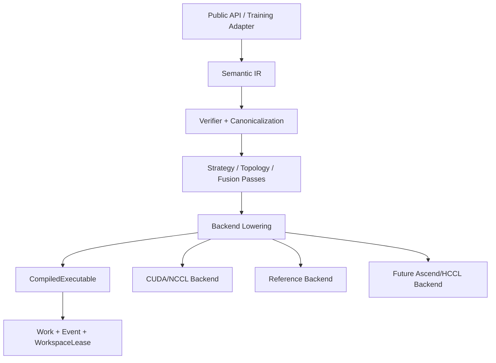

# lowbit_comm 0.3.0 软件架构设计说明书

## 1. 架构决策

0.3.0 是破坏性架构大重构。项目保留现有 Git 仓库、历史、性能证据和底层 Kernel，
在 `codex/v0.3.0-major-refactor` 分支重新建立 Python 架构。新代码不兼容旧 API，也不
通过包装旧 Python 控制面实现功能。

设计借鉴 LLVM 的稳定语义 IR、Pass Pipeline 与目标 Backend lowering，以及 DeepSpeed
对训练状态生命周期的明确所有权；不建设万能通信编译器，也不把完整训练 Engine 放入
通信 Core。

## 2. 总体架构



依赖只允许向下。Core 不认识 Torch/设备；Backend 不认识 DDP bucket、optimizer 或 qWD
policy；Adapter 通过 Core Protocol 构造程序并拥有训练状态。

## 3. 目标目录

```text
src/lowbit_comm/
├── __init__.py
├── core/
│   ├── types.py
│   ├── operations.py
│   ├── program.py
│   ├── lowered.py
│   ├── context.py
│   ├── errors.py
│   └── execution_info.py
├── compiler/
│   ├── verifier.py
│   ├── pipeline.py
│   ├── registry.py
│   ├── cost_model.py
│   └── passes/
├── runtime/
│   ├── work.py
│   ├── event.py
│   └── workspace.py
├── backends/
│   ├── reference/
│   └── cuda/
│       ├── backend.py
│       ├── lowering.py
│       ├── executors.py
│       ├── workspace.py
│       ├── transports/
│       └── csrc/
└── adapters/
    ├── ddp/
    └── sharded/
```

迁移期旧 `ccdl_comm/` 只作为 oracle 与源码来源；`src/lowbit_comm` 禁止导入它。最终
门禁通过后删除旧控制面。

## 4. Core 数据模型

### 4.1 稳定类型

```python
class DataType(Enum):
    FP16 = "fp16"
    BF16 = "bf16"
    FP32 = "fp32"

@dataclass(frozen=True, slots=True)
class FullTensor:
    dtype: DataType

@dataclass(frozen=True, slots=True)
class ReducedShard:
    dtype: DataType
    layout_version: int

@dataclass(frozen=True, slots=True)
class QuantizedWire:
    bit: int
    group_size: int
    quant_type: str = "linear"
    compact: bool = True

@dataclass(frozen=True, slots=True)
class FullPrecisionWire:
    dtype: DataType
```

类型不持有 tensor、process group、stream 或 workspace。

### 4.2 CommunicationProgram

```python
@dataclass(frozen=True, slots=True)
class CommunicationProgram:
    operation: Operation
    output: OutputType
    wire: WireFormat
    algorithm: Algorithm
    async_op: bool = True
    error_feedback: ErrorFeedbackDomain = ErrorFeedbackDomain.NONE
```

`operation/output/wire/algorithm` 正交。输出为 FP16 不意味着 wire 为 FP16。

### 4.3 编译与运行上下文

`CompileContext` 只包含可哈希静态事实：rank、world size、node count、shape、dtype、
device type、architecture、topology signature、software fingerprint、layout generation、
workspace budget 和可选显式 physical primitive。

`RuntimeBindings` 单独持有 process group、stream provider、allocator 和 Backend runtime。
Semantic IR 因而可稳定比较、缓存和测试。

## 5. Compiler Pipeline

```text
Verify
-> Canonicalize
-> Legalize
-> SelectStrategy
-> LowerTopology
-> Fuse
-> PlanWorkspace
-> BindBackend
```

- Verify：验证数学语义与类型组合；
- Canonicalize：规范 shape、dtype、reduce、padding；
- Legalize：根据 capability 拒绝或展开操作；
- SelectStrategy：显式严格，`auto` 查询证据；
- LowerTopology：生成单机/分层通信阶段；
- Fuse：选择已存在的融合 Kernel；
- PlanWorkspace：产生静态 buffer layout 与预算；
- BindBackend：产生可重复运行的 CompiledExecutable。

`run()` 不得访问 Registry 或成本模型。

## 6. Backend Protocol

```python
class CommunicationBackend(Protocol):
    name: str
    abi_version: int

    def capabilities(self, context: CompileContext) -> BackendCapabilities: ...
    def lower(
        self,
        program: CommunicationProgram,
        context: CompileContext,
        bindings: RuntimeBindings,
    ) -> LoweredProgram: ...
    def compile(self, lowered: LoweredProgram) -> CompiledExecutable: ...
```

Registry 按 Backend target 注册，而不是按 collective × strategy × layout 的笛卡尔积
注册实现类。Backend 内部通过 legalizer 和 lowering pattern 处理组合。

## 7. 数据流

### 7.1 Quantized FullTensor

```text
FP local tensor
-> quant-pack destination shards
-> INT payload all-to-all
-> fused dequant-reduce-mean-requantize
-> globally reduced INT shard
-> INT payload all-gather
-> one gathered-dequant-writeback kernel on every rank
-> identical FP FullTensor
```

第一阶段把每个目标分片的 rank 贡献送至 owner；owner 完成全局归约并重新量化。第二阶段
收集量化后的全局分片。最后一个 Kernel 只解码和按 offset 写回，不重复归约。

若 fused requantize 不可用，可采用语义等价的非融合量化操作，但跨 rank wire 仍保持
量化。必须改用 FP collective 时，effective wire 改为 FullPrecisionWire 并记录 fallback。

### 7.2 Quantized ReducedShard

```text
FP local tensor
-> quantized reduce-scatter
-> local dequant-reduce-mean
-> ReducedShard
```

该路径没有最终 all-gather。consumer 按 layout version 验证并更新本地参数分片。

### 7.3 FullPrecision

Native NCCL 与低频 FP parameter refresh 使用 FullPrecisionWire。它们是独立算法，不是
Quantized FullTensor 的隐藏恢复模式。

## 8. Error Feedback 事务

Gradient EF 以本地准备发送值与本地量化重构值之差定义；Parameter EF 定义在参数差值
域。二者使用不同状态类型和 namespace。

```text
prepare compensated input
-> launch
-> finish GPU postprocessing
-> accepted training boundary
-> commit state
```

AMP overflow/step skip 不提交参数通信状态；checkpoint restore 后强制 FP refresh；layout、
world size 或 schema 改变使旧状态失效并触发重编译。

## 9. Work 与 Workspace

Work 终态包括 collective、所有 GPU 后处理、必要状态更新和输出可见性。WorkspacePool
按静态 WorkspaceKey 管理资源；每次 run 的 Work 持有 lease，completion event ready
后释放。异步并发不得共享 in-flight buffer，用户输出不得自动回池。
编译期 `BufferPlan` 决定 send/receive/reduced/requantized/gathered 等内部 buffer；
`BudgetedWorkspacePool` 记录分配、复用、占用及峰值，key 的 size 发生变化时严格失败。

## 10. Adapter

DDP Adapter 把 GradBucket 映射为 FullTensor Program，并将 Work 转为 PyTorch Future；
它拥有 bucket generation、AMP 事件和 Gradient EF。

Sharded Adapter 使用 ReducedShard 更新 rank-local optimizer/master state。qWD Adapter
拥有 parameter delta、mixed-bit、误差采样和 periodic FP refresh；Core 不拥有这些状态。

## 11. 策略与证据

成本模型先用理论公式过滤候选，再用版本化 benchmark evidence 决定 `auto`。证据键包括
GPU、软件栈、拓扑、world size、dtype、numel、wire、output、EF 和 Kernel ABI。没有
精确证据时选择 Native。

CUDA 0.3.0 当前生产 primitive 为：`nccl_all_reduce`、
`nccl_all_gather_local_reduce`、`all_to_all_local_reduce` 与
`all_to_all_quantized_all_gather`。Ring/Tree/Hierarchical schedule 不等于生产能力，
只有绑定 executor、声明 capability 并通过 A6000 门禁后才能被显式选择或进入 `auto`。

## 12. 动态 Metadata

各 rank 先以固定 24×int64 packet 执行设备 collective。CUDA metadata kernel 校验协议、
dtype、wire、layout、shape 乘积、精确 payload 字节数和有界 stride，并生成固定 12×int64
descriptor。descriptor 通过一次异步 D2H 拷贝到复用的 pinned buffer；payload collective
可先排入当前 CUDA stream。Python 只用 descriptor 创建动态输出对象，不再解析原始 packet。

## 13. 错误与 fallback

显式算法不自动回退。`auto` 的编译期 fallback 固化到 ExecutionInfo。collective 提交后
错误使所有 rank 一致失败，运行时不得透明重试不同 collective 顺序。

## 14. 架构门禁

CI 使用 AST 与依赖图验证：

- Core 不导入设备或训练框架；
- Backend 不导入 Adapter/高层 API；
- Backend 之间无交叉依赖；
- 新代码不导入 `ccdl_comm`；
- 跨层强连通循环为零；
- 热路径不包含禁止操作；
- 公共 API 不包含 `restore_mode` 和旧类型。

## 15. 分支与发布

采用两阶段集成：

1. `codex/correctness-kernel-hardening` 先作为 0.2.x 最终基线合入 main 并打 tag；
2. v0.3.0 分支更新到该 main 之上；
3. v0.3.0 PR 只展示破坏性架构重构；
4. 门禁全部通过后删除旧控制面；
5. 从洁净 clone 构建、安装并完成 A6000 验证后发布 `lowbit_comm==0.3.0`。
